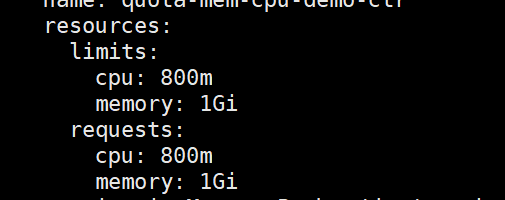
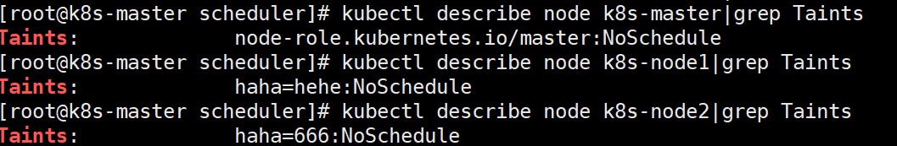
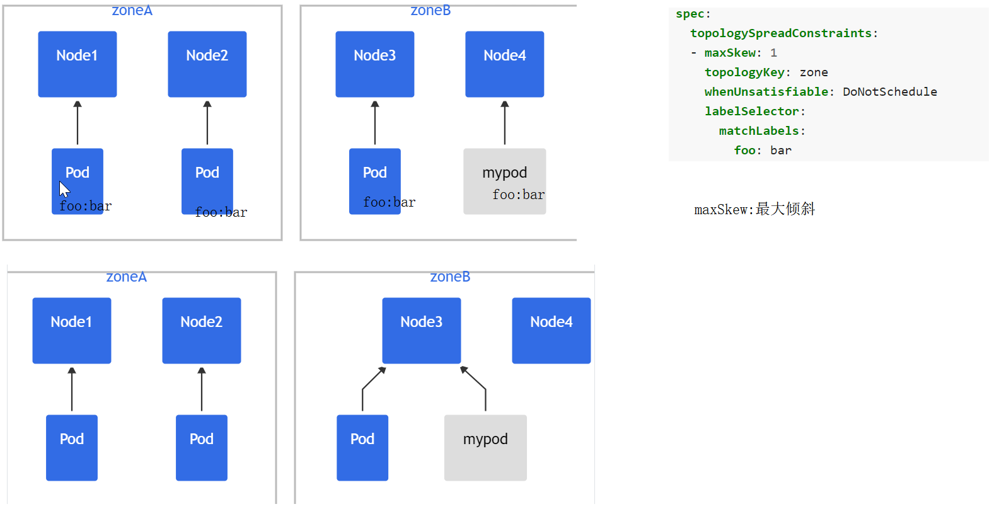

<center>
<h1>
    Kubernetes 调度原理
    </h1>    
</center>


# 一、ResourceQuota

https://kubernetes.io/zh/docs/concepts/policy/resource-quotas/

## 1、简介

- 当多个用户或团队共享具有固定节点数目的集群时，人们会担心**有人使用超过其基于公平原则所分配到的资源量。**
- 资源配额是帮助管理员解决这一问题的工具。
- 资源配额，通过 `ResourceQuota` 对象来定义，**对每个命名空间的资源消耗总量提供限制**。 它可以**限制**命名空间中**某种类型的对象的总数目上限**，**也可以限制命令空间中的 Pod 可以使用的计算资源的总上限**。
- 资源配额的工作方式如下：
  - 不同的团队可以在不同的命名空间下工作，目前这是非约束性的，在未来的版本中可能会通过 ACL (Access Control List 访问控制列表) 来实现强制性约束。
  - **集群管理员可以为每个命名空间创建一个或多个 ResourceQuota 对象。**
  - 当用户在命名空间下创建资源（如 Pod、Service 等）时，Kubernetes 的配额系统会 跟踪集群的资源使用情况，**以确保使用的资源用量不超过 ResourceQuota 中定义的硬性资源限额**。
  - 如果资源创建或者更新请求违反了配额约束，那么该请求会报错（HTTP 403 FORBIDDEN）， 并在消息中给出有可能违反的约束。
  - 如果命名空间下的计算资源 （如 `cpu` 和 `memory`）的**配额被启用**，则**用户必须为 这些资源设定请求值（request）和约束值（limit）**，否则配额系统将拒绝 Pod 的创建。 提示: 可使用 `LimitRanger` 准入控制器来为没有设置计算资源需求的 Pod 设置默认值。


## 2、实战测试

https://kubernetes.io/zh/docs/tasks/administer-cluster/manage-resources/quota-memory-cpu-namespace/


## 3、计算资源配额

| 资源名称           | 描述                                                         |
| ------------------ | ------------------------------------------------------------ |
| `limits.cpu`       | 所有非终止状态的 Pod，其 CPU 限额总量不能超过该值。          |
| `limits.memory`    | 所有非终止状态的 Pod，其内存限额总量不能超过该值。           |
| `requests.cpu`     | 所有非终止状态的 Pod，其 CPU 需求总量不能超过该值。          |
| `requests.memory`  | 所有非终止状态的 Pod，其内存需求总量不能超过该值。           |
| `hugepages-<size>` | 对于所有非终止状态的 Pod，针对指定尺寸的巨页请求总数不能超过此值。 |
| `cpu`              | 与 `requests.cpu` 相同。                                     |
| `memory`           | 与 `requests.memory` 相同。                                  |


## 4、存储资源配额

[https://kubernetes.io/zh/docs/concepts/policy/resource-quotas/#%E5%AD%98%E5%82%A8%E8%B5%84%E6%BA%90%E9%85%8D%E9%A2%9D](https://kubernetes.io/zh/docs/concepts/policy/resource-quotas/#存储资源配额)

| 资源名称                                                     | 描述                                                         |
| ------------------------------------------------------------ | ------------------------------------------------------------ |
| `requests.storage`                                           | 所有 PVC，存储资源的需求总量不能超过该值。                   |
| `persistentvolumeclaims`                                     | 在该命名空间中所允许的 [PVC](https://kubernetes.io/zh/docs/concepts/storage/persistent-volumes/#persistentvolumeclaims) 总量。 |
| `<storage-class-name>.storageclass.storage.k8s.io/requests.storage` | 在所有与 `<storage-class-name>` 相关的持久卷申领中，存储请求的总和不能超过该值。 |
| `<storage-class-name>.storageclass.storage.k8s.io/persistentvolumeclaims` | 在与 storage-class-name 相关的所有持久卷申领中，命名空间中可以存在的[持久卷申领](https://kubernetes.io/zh/docs/concepts/storage/persistent-volumes/#persistentvolumeclaims)总数。 |

例如，如果一个操作人员针对 `gold` 存储类型与 `bronze` 存储类型设置配额， 操作人员可以定义如下配额：

- `gold.storageclass.storage.k8s.io/requests.storage: 500Gi`
- `bronze.storageclass.storage.k8s.io/requests.storage: 100Gi`


## 5、对象数量配额

[https://kubernetes.io/zh/docs/concepts/policy/resource-quotas/#%E5%AF%B9%E8%B1%A1%E6%95%B0%E9%87%8F%E9%85%8D%E9%A2%9D](https://kubernetes.io/zh/docs/concepts/policy/resource-quotas/#对象数量配额)

你可以使用以下语法对所有标准的、命名空间域的资源类型进行配额设置：

- `count/<resource>.<group>`：用于非核心（core）组的资源
- `count/<resource>`：用于核心组的资源

这是用户可能希望利用对象计数配额来管理的一组资源示例。

- `count/persistentvolumeclaims`
- `count/services`
- `count/secrets`
- `count/configmaps`
- `count/replicationcontrollers`
- `count/deployments.apps`
- `count/replicasets.apps`
- `count/statefulsets.apps`
- `count/jobs.batch`
- `count/cronjobs.batch`


对有限的一组资源上实施一般性的对象数量配额也是可能的。 此外，还可以进一步按资源的类型设置其配额。

支持以下类型：

| 资源名称                 | 描述                                                         |
| ------------------------ | ------------------------------------------------------------ |
| `configmaps`             | 在该命名空间中允许存在的 ConfigMap 总数上限。                |
| `persistentvolumeclaims` | 在该命名空间中允许存在的 [PVC](https://kubernetes.io/zh/docs/concepts/storage/persistent-volumes/#persistentvolumeclaims) 的总数上限。 |
| `pods`                   | 在该命名空间中允许存在的非终止状态的 Pod 总数上限。Pod 终止状态等价于 Pod 的 `.status.phase in (Failed, Succeeded)` 为真。 |
| `replicationcontrollers` | 在该命名空间中允许存在的 ReplicationController 总数上限。    |
| `resourcequotas`         | 在该命名空间中允许存在的 ResourceQuota 总数上限。            |
| `services`               | 在该命名空间中允许存在的 Service 总数上限。                  |
| `services.loadbalancers` | 在该命名空间中允许存在的 LoadBalancer 类型的 Service 总数上限。 |
| `services.nodeports`     | 在该命名空间中允许存在的 NodePort 类型的 Service 总数上限。  |
| `secrets`                | 在该命名空间中允许存在的 Secret 总数上限。                   |


## 6、优先级

```yaml
apiVersion: v1
kind: List  ### 集合   ---
items:
- apiVersion: v1
  kind: ResourceQuota
  metadata:
    name: pods-high
  spec:
    hard:
      cpu: "1000"
      memory: 200Gi
      pods: "10"
    scopeSelector:
      matchExpressions:
      - operator : In
        scopeName: PriorityClass
        values: ["high"]
- apiVersion: v1
  kind: ResourceQuota
  metadata:
    name: pods-medium
  spec:
    hard:
      cpu: "10"
      memory: 20Gi
      pods: "10"
    scopeSelector:
      matchExpressions:
      - operator : In
        scopeName: PriorityClass
        values: ["medium"]
- apiVersion: v1
  kind: ResourceQuota
  metadata:
    name: pods-low
  spec:
    hard:
      cpu: "5"
      memory: 10Gi
      pods: "10"
    scopeSelector:
      matchExpressions:
      - operator : In
        scopeName: PriorityClass
        values: ["low"]
        
---
########################
apiVersion: v1
kind: Pod
metadata:
  name: high-priority
spec:
  containers:
  - name: high-priority
    image: ubuntu
    command: ["/bin/sh"]
    args: ["-c", "while true; do echo hello; sleep 10;done"]
    resources:
      requests:
        memory: "10Gi"
        cpu: "500m"
      limits:
        memory: "10Gi"
        cpu: "500m"
  priorityClassName: high  ### priorityClass指定的是什么。就优先使用这个配额约束。
```


# 二、LimitRange

https://kubernetes.io/zh/docs/concepts/policy/limit-range/


批量删除

kubectl delete pods my-dep-5b7868d854-6cgxt quota-mem-cpu-demo quota-mem-cpu-demo2 -n hello

## 1、简介

- 默认情况下， Kubernetes 集群上的容器运行使用的[计算资源](https://kubernetes.io/zh/docs/concepts/configuration/manage-resources-containers/)没有限制。 
- 使用资源配额，集群管理员可以以[名字空间](https://kubernetes.io/zh/docs/concepts/overview/working-with-objects/namespaces/)为单位，限制其资源的使用与创建。 
- 在命名空间中，一个 Pod 或 Container 最多能够使用命名空间的资源配额所定义的 CPU 和内存用量。 
- 有人担心，**一个 Pod 或 Container 会垄断所有可用的资源**。 LimitRange 是在命名空间内限制资源分配（给多个 Pod 或 Container）的策略对象。
- 超额指定。配额  1和cpu，1g内存。
  - Pod。  requests: cpu: 1,memory: 1G。这种直接一次性占完
  - 我们需要使用LimitRange限定一个合法范围
    - 限制每个Pod能写的合理区间


一个 *LimitRange（限制范围）* 对象提供的限制能够做到：

- 在一个命名空间中实施对每个 Pod 或 Container 最小和最大的资源使用量的限制。
- 在一个命名空间中实施对每个 PersistentVolumeClaim 能申请的最小和最大的存储空间大小的限制。
- 在一个命名空间中实施对一种资源的申请值和限制值的比值的控制。
- 设置一个命名空间中对计算资源的默认申请/限制值，并且自动的在运行时注入到多个 Container 中。


## 2、实战

- [如何配置每个命名空间最小和最大的 CPU 约束](https://kubernetes.io/zh/docs/tasks/administer-cluster/manage-resources/cpu-constraint-namespace/)。
- [如何配置每个命名空间最小和最大的内存约束](https://kubernetes.io/zh/docs/tasks/administer-cluster/manage-resources/memory-constraint-namespace/)。
- [如何配置每个命名空间默认的 CPU 申请值和限制值](https://kubernetes.io/zh/docs/tasks/administer-cluster/manage-resources/cpu-default-namespace/)。
- [如何配置每个命名空间默认的内存申请值和限制值](https://kubernetes.io/zh/docs/tasks/administer-cluster/manage-resources/memory-default-namespace/)。
- [如何配置每个命名空间最小和最大存储使用量](https://kubernetes.io/zh/docs/tasks/administer-cluster/limit-storage-consumption/#limitrange-to-limit-requests-for-storage)。

```yaml
apiVersion: v1
kind: LimitRange
metadata:
  name: cpu-min-max-demo-lr
  namespace: hello
spec:
  limits:
  - max:
      cpu: "800m"  ## 最大不超过800m
      memory: "1Gi"  ## Pod不写limit,request，那么Limit、request就会用到默认最大值
    min: 
      cpu: "200m"  ### 起步申请200
      memory: "20m"
    type: Container
```

```yaml
apiVersion: v1
kind: Pod
metadata:
  name: quota-mem-cpu-demo2
  namespace: hello
spec:
  containers:
  - name: quota-mem-cpu-demo-ctr
    image: nginx
    resources:
      limits:
        memory: "20Mi"   
        cpu: "900m"   ## 违背了 max.cpu: "800m"
      requests:
        memory: "10Mi"
        cpu: "20m"   ## 20m违背了 min.cpu: "200m"
```


- ResourceQuota：CPU内存都限制了
- LimitRange：只给了CPU的合法区别。
  - 以后Pod只需要写内存的合法区间
  
  - **LimitRange**都指定范围。Pod可以不用指定，如下，用到默认最大值
  
  - 
  
  - ```yaml
       default	<map[string]string>: 给limits默认值
          
       defaultRequest	<map[string]string>: 给requests默认值的
          
       max	<map[string]string>: 最大使用量
          
       maxLimitRequestRatio	<map[string]string>: 3 
       		limit / request <= ratio;
       		800/200 = 4 > 3 ## 被拒绝
       		
       ```
  
  
       min	<map[string]string>: 最小使用量
        
       type	<string> -required-: Container、Pod
  
    ```
  
  - ```yaml
    apiVersion: v1
    kind: LimitRange
    metadata:
      name: limit-memory-ratio-pod
    spec:
      limits:
      - maxLimitRequestRatio:
          memory: 2
          cpu: 3
        type: Pod
      - type: Container
        max: 
        min: 
    ```


# 三、调度原理


Pod。scheduler要计算他应该去哪个Node合适。（调度）

nodeSelector ： 指定去哪些Node


## 1、nodeSelector 

`nodeSelector` 是节点选择约束的最简单推荐形式。`nodeSelector` 是 PodSpec 的一个字段。 它包含键值对的映射。为了使 pod 可以在某个节点上运行，该节点的标签中 必须包含这里的每个键值对（它也可以具有其他标签）。 最常见的用法的是一对键值对。

```yaml
apiVersion: v1
kind: Pod
metadata:
  name: nginx
  labels:
    env: test
spec:
  containers:
  - name: nginx
    image: nginx
    imagePullPolicy: IfNotPresent
  nodeSelector:
    disktype: ssd  ## 标签名。每个Node节点可以打标签
```


```sh
ingress-nginx：参照
```


> 除了你[添加](https://kubernetes.io/zh/docs/concepts/scheduling-eviction/assign-pod-node/#attach-labels-to-node)的标签外，节点还预先填充了一组标准标签。 这些标签有：
>
> - [`kubernetes.io/hostname`](https://kubernetes.io/zh/docs/reference/kubernetes-api/labels-annotations-taints/#kubernetes-io-hostname)
> - [`failure-domain.beta.kubernetes.io/zone`](https://kubernetes.io/zh/docs/reference/kubernetes-api/labels-annotations-taints/#failure-domainbetakubernetesiozone)
> - [`failure-domain.beta.kubernetes.io/region`](https://kubernetes.io/zh/docs/reference/kubernetes-api/labels-annotations-taints/#failure-domainbetakubernetesioregion)
> - [`topology.kubernetes.io/zone`](https://kubernetes.io/zh/docs/reference/kubernetes-api/labels-annotations-taints/#topologykubernetesiozone)
> - [`topology.kubernetes.io/region`](https://kubernetes.io/zh/docs/reference/kubernetes-api/labels-annotations-taints/#topologykubernetesiozone)
> - [`beta.kubernetes.io/instance-type`](https://kubernetes.io/zh/docs/reference/kubernetes-api/labels-annotations-taints/#beta-kubernetes-io-instance-type)
> - [`node.kubernetes.io/instance-type`](https://kubernetes.io/zh/docs/reference/kubernetes-api/labels-annotations-taints/#nodekubernetesioinstance-type)
> - [`kubernetes.io/os`](https://kubernetes.io/zh/docs/reference/kubernetes-api/labels-annotations-taints/#kubernetes-io-os)
> - [`kubernetes.io/arch`](https://kubernetes.io/zh/docs/reference/kubernetes-api/labels-annotations-taints/#kubernetes-io-arch)
>
> > **说明：**
> >
> > 这些标签的值是特定于云供应商的，因此不能保证可靠。 例如，`kubernetes.io/hostname` 的值在某些环境中可能与节点名称相同， 但在其他环境中可能是一个不同的值。


### 1、直接不用调度

```yaml
apiVersion: v1
kind: Pod
metadata:
  name: nginx-nodename
  labels:
    env: test
spec:
  nodeName: k8s-node1  ## master默认除外  ## scheduler无需工作
  containers:
  - name: nginx
    image: nginx
    imagePullPolicy: IfNotPresent
```


## 2、Affinity(亲和) and anti-affinity(反亲和)

Pod：到底去哪些机器。

- scheduler 进行自己计算调度
- 某些机器对这些Pod有吸引力。Pod希望scheduler 把他调度到他喜欢的**哪些机器**。

亲和性能设置如下

```yaml
KIND:     Pod
VERSION:  v1

RESOURCE: affinity <Object>

DESCRIPTION:
     If specified, the pod's scheduling constraints

     Affinity is a group of affinity scheduling rules.

FIELDS:
   nodeAffinity	<Object>: 指定亲和的节点（机器）。

   podAffinity	<Object>: 指定亲和的Pod。这个Pod部署到哪里看他亲和的Pod在哪里
     Describes pod affinity scheduling rules (e.g. co-locate this pod in the
     same node, zone, etc. as some other pod(s)).

   podAntiAffinity	<Object>： Pod的反亲和。
     Describes pod anti-affinity scheduling rules (e.g. avoid putting this pod
     in the same node, zone, etc. as some other pod(s)).

```


### 1、Node Affinity （节点亲和）

**nodeSelector 的升级版**。节点亲和概念上类似于 `nodeSelector`，它使你可以根据节点上的标签来约束 pod 可以调度到哪些节点。


与nodeSelector差异

- 引入运算符：In，NotIn（labelSelector语法）
- 支持枚举label的可能的取值。如 zone in [az1,az2,az2]
- 支持**硬性过滤**和**软性评分**
  - 硬过滤规则支持指定 **多条件之间的逻辑或运算**
  
  - 软性评分规则支持 **设置条件权重**
  
  - 
    
  - 

```yaml
apiVersion: v1
kind: Pod
metadata:
  name: with-node-affinity
spec:
  affinity:
    nodeAffinity:
      requiredDuringSchedulingIgnoredDuringExecution: #硬性过滤：排除不具备指定label的node
        nodeSelectorTerms: 
          - matchExpressions:  #所有matchExpressions满足条件才行
              - key: disktype
                operator: In
                values:
                  - ssd
                  - hdd
 ##    matchExpressions	<[]Object> \matchFields <[]Object>
 ## DuringScheduling（调度期间有效）IgnoredDuringExecution（执行期间忽略）、亲和策略与反亲策略只在Pod调度期间有效，执行期间（Pod运行期间）会被忽略。
 ## required指定硬标准、preferred指定软标准
      preferredDuringSchedulingIgnoredDuringExecution:  #软性评分：不具备指定label的node打低分，降低node被选中的几率
        - weight: 1
          preference:
            matchExpressions: 
              - key: disktype
                operator: In
                values:
                  - ssd
  containers:
    - name: with-node-affinity
      image: nginx
      
##注意：如果你修改或删除了 pod 所调度到的节点的标签，pod 不会被删除。换句话说，亲和选择只在 pod 调度期间有效。

```


### 2、podAffinity/podAntiAffinity

Pod之间的亲和性与反亲和性（inter-pod affinity and anti-affinity）**可以基于已经运行在节点上的 Pod 的标签**（而不是节点的标签）来限定 Pod 可以被调度到哪个节点上。此类规则的表现形式是：

- 当 X 已经运行了一个或者多个满足规则 Y 的 Pod 时，待调度的 Pod 应该（或者不应该 - 反亲和性）在 X 上运行

  - 规则 Y 以 LabelSelector 的形式表述，附带一个可选的名称空间列表

    > 与节点不一样，Pod 是在名称空间中的（因此，Pod的标签是在名称空间中的），针对 Pod 的 LabelSelector 必须同时指定对应的名称空间

  - X 是一个拓扑域的概念，例如节点、机柜、云供应商可用区、云供应商地域，等。X 以 `topologyKey` 的形式表达，该 Key代表了节点上代表拓扑域（topology domain）的一个标签。

 Pod 亲和性与反亲和性结合高级别控制器（例如 ReplicaSet、StatefulSet、Deployment 等）一起使用时，可以非常实用。此时可以很容易的将一组工作复杂调度到同一个 topology，例如，同一个节点。 


示例：在一个三节点的集群中，部署一个使用 redis 的 web 应用程序，并期望 web-server 尽可能与 redis 在同一个节点上。

```yaml
#下面是 redis deployment 的 yaml 片段，包含三个副本以及 `app=store` 标签选择器。Deployment 中配置了 `PodAntiAffinity`，确保调度器不会将三个副本调度到一个节点上：
apiVersion: apps/v1
kind: Deployment
metadata:
  name: redis-cache
spec:
  selector:
    matchLabels:
      app: store
  replicas: 2
  template:
    metadata:
      labels:
        app: store
    spec:
      affinity:
        podAntiAffinity:
          requiredDuringSchedulingIgnoredDuringExecution:
          - labelSelector:  #选Pod的Label
              matchExpressions:
              - key: app
                operator: In
                values:
                - store
            topologyKey: "kubernetes.io/hostname"
      containers:
      - name: redis-server
        image: redis:3.2-alpine
```

```yaml
apiVersion: apps/v1
kind: Deployment
metadata:
  name: web-server
spec:
  selector:
    matchLabels:
      app: web-store
  replicas: 2
  template:
    metadata:
      labels:
        app: web-store
    spec:
      affinity:
        podAntiAffinity:
          requiredDuringSchedulingIgnoredDuringExecution:
          - labelSelector:
              matchExpressions:
              - key: app
                operator: In
                values:
                - web-store
            topologyKey: "kubernetes.io/hostname" #不能再同一个拓扑网络
        podAffinity:
          requiredDuringSchedulingIgnoredDuringExecution:
          - labelSelector:
              matchExpressions:
              - key: app
                operator: In
                values:
                - store
            topologyKey: "kubernetes.io/hostname" # 需要在同一个拓扑网络
      containers:
      - name: web-app
        image: nginx:1.12-alpine
```

| k8s-001      | k8s-002     | k8s-003     |
| ------------ | ----------- | ----------- |
| web-server-1 | webserver-2 | webserver-3 |
| cache-1      | cache-2     | cache-3     |


## 3、污点与容忍

https://kubernetes.io/zh/docs/concepts/scheduling-eviction/taint-and-toleration/

### 1、概述

Pod 中存在属性 Node selector / Node affinity，用于将 Pod 指定到合适的节点。

相对的，节点中存在属性 `污点 taints`，使得节点可以排斥某些 Pod。

污点和容忍（taints and tolerations）成对工作，以确保 Pod 不会被调度到不合适的节点上。

- 可以为节点增加污点（taints，一个节点可以有 0-N 个污点）
- 可以为 Pod 增加容忍（toleration，一个 Pod 可以有 0-N 个容忍）
- 如果节点上存在污点，则该节点不会接受任何不能容忍（tolerate）该污点的 Pod。

### 2、向节点添加污点

```yaml
kubectl taint nodes node1 key=value:NoSchedule
#该命令为节点 node1 添加了一个污点。污点是一个键值对，在本例中，污点的键为 key，值为 value，污点效果为 NoSchedule。此污点意味着 Kubernetes 不会向该节点调度任何 Pod，除非该 Pod 有一个匹配的容忍（toleration）

kubectl taint nodes 节点名  污点key=污点的值:污点的效果
# 比如matser的污点：有这个污点不能调度
node-role.kubernetes.io/master:NoSchedule

#执行如下命令可以将本例中的污点移除：
kubectl taint nodes node1 key:NoSchedule-
```

污点写法；  **k=v:effect**

  haha=hehe:NoExecute ： 节点上的所有。Pod全部被驱逐。

停机维护：

- node1： Pod
- 给node1打个污点。haha=hehe:NoExecute；Pod被赶走。。。。在其他机器拉起


支持的效果 `effect` 有：

- **`NoSchedule`**：不调度。不给给我这里调度Pod
- **`PreferNoSchedule`** 比 `NoSchedule` 更宽容一些，Kubernetes 将尽量避免将没有匹配容忍的 Pod 调度到该节点上，但是并不是不可以
- **`NoExecute`** 不能在节点上运行（如果已经运行，将被驱逐）

master节点默认是由一个污点的


### 3、向 Pod 添加容忍




PodSpec 中有一个 `tolerations` 字段，可用于向 Pod 添加容忍。下面的两个例子中定义的容忍都可以匹配上例中的污点，包含这些容忍的 Pod 也都可以被调度到 `node1` 节点上：

```yaml
#容忍1
tolerations:
- key: "key"
  operator: "Equal"
  value: "value"
  effect: "NoSchedule"
  

#容忍2
tolerations:
- key: "key"
  operator: "Exists"
  effect: "NoSchedule"


#使用容忍
apiVersion: v1
kind: Pod
metadata:
  name: nginx-tolerations
  labels:
    env: test
spec:
  containers:
  - name: nginx
    image: nginx
    imagePullPolicy: IfNotPresent
  tolerations:
  - key: "example-key"
    operator: "Exists"
    effect: "NoSchedule"
```


### 4、污点与容忍的匹配

当满足如下条件时，Kubernetes 认为容忍和污点匹配：

- 键（key）相同
- 效果（effect）相同
- 污点的operator为：
  - `Exists` （此时污点中不应该指定 `value`）
  - 或者 `Equal` （此时容忍的 `value` 应与污点的 `value` 相同）

如果不指定 `operator`，则其默认为 `Equal`

> 特殊情况
>
> 存在如下两种特殊情况：
>
> - 容忍中未定义 `key` 但是定义了 operator 为 `Exists`，Kubernetes 认为此容忍匹配所有的污点，如下所示：
>
> ```yaml
> tolerations:
>  - operator: "Exists"  ### 啥都能忍
> #最终，所有有污点的机器我们都能容忍，都可以调度
> ```
>
> - 容忍中未定义 `effect` 但是定义了 `key`，Kubernetes 认为此容忍匹配所有 `effect`，如下所示：
>
> ```yaml
> tolerations:
>  - key: "key"
>    operator: "Exists"  ## 无论无论效果是什么都能忍
>    
>    
> #最终，有这个污点的机器我们可以容忍，pod可以调度和运行
> tolerations:
>  - key: "key"
>    operator: "Exists"  
>    effect: "NoExecute"  ## 默认节点有不能执行的污点。节点Pod都会被赶走。Pod只要忍不执行，节点有不执行的污点，Pod也不会被驱逐。可以指定 tolerationSeconds：来说明Pod最多在Node上呆多久
>    
>    
>    
>    ## k8s底层发现网络有问题会给这个机器打上
>    	## key：“node.kubernetes.io/unreachable”  effect: "NoExecute"。 Pod立马驱动？？
>    	
>    
> ```


**一个节点上可以有多个污点，同时一个 Pod 上可以有多个容忍。**Kubernetes 使用一种类似于过滤器的方法来处理多个节点和容忍：

- 对于节点的所有污点，检查 Pod 上是否有匹配的容忍，如果存在匹配的容忍，则忽略该污点；
- 剩下的不可忽略的污点将对该 Pod 起作用

例如：

- 如果存在至少一个不可忽略的污点带有效果 `NoSchedule`，则 Kubernetes 不会将 Pod 调度到该节点上
- 如果没有不可忽略的污点带有效果 `NoSchedule`，但是至少存在一个不可忽略的污点带有效果 `PreferNoSchedule`，则 Kubernetes 将尽量避免将该 Pod 调度到此节点
- 如果存在至少一个忽略的污点带有效果NoExecute，则：
  - 假设 Pod 已经在该节点上运行，Kubernetes 将从该节点上驱逐（evict）该 Pod
  - 假设 Pod 尚未在该节点上运行，Kubernetes 将不会把 Pod 调度到该节点


案例分析

```yaml
#假设您给一个节点添加了三个污点：
kubectl taint nodes node1 key1=value1:NoSchedule
kubectl taint nodes node1 key1=value1:NoExecute
kubectl taint nodes node1 key2=value2:NoSchedule


#同时，有一个 Pod 带有两个容忍
tolerations:
- key: "key1"
  operator: "Equal"
  value: "value1"
  effect: "NoSchedule"
- key: "key1"
  operator: "Equal"
  value: "value1"
  effect: "NoExecute"
```

在这个案例中，Pod 上有两个容忍，匹配了节点的前两个污点，只有节点的第三个污点对该 Pod 来说不可忽略，该污点的效果为 `NoSchedule`：

- Kubernetes 不会将此 Pod 调度到该节点上
- 如果 Kubernetes 先将 Pod 调度到了该节点，后向该节点添加了第三个污点，则 Pod 将继续在该节点上运行而不会被驱逐（节点上带有 `NoExecute` 效果的污点已被 Pod 上的第二个容忍匹配，因此被忽略）

通常，在带有效果 `NoExecute` 的污点被添加到节点时，节点上任何不容忍该污点的 Pod 将被立刻驱逐，而容忍该污点的 Pod 则不会被驱逐。

此外，带有效果 `NoExecute` 的污点还可以指定一个可选字段 `tolerationSeconds`，该字段指定了 Pod 在多长时间后被驱逐，例如：

```yaml
tolerations:
- key: "key1"
  operator: "Equal"
  value: "value1"
  effect: "NoExecute"
  tolerationSeconds: 3600
#如果 Pod 已经运行在节点上，再向节点增加此污点时，Pod 将在该节点上继续运行 3600 秒，然后才被驱逐。如果污点在此之间被移除，则 Pod 将不会被驱逐。
```

### 5、基于污点的驱逐（TaintBasedEviction）

 NoExecute 的污点效果，对已经运行在节点上的 Pod 施加如下影响：

- 不容忍该污点的 Pod 将立刻被驱逐
- 容忍该污点的 Pod 在未指定 `tolerationSeconds` 的情况下，将继续在该节点上运行
- 容忍该污点的 Pod 在指定了 `tolerationSeconds` 的情况下，将在指定时间超过时从节点上驱逐

> `tolerationSeconds` 字段可以理解为 Pod 容忍该污点的 `耐心`：
>
> - 超过指定的时间，则达到 Pod 忍耐的极限，Pod 离开所在节点
> - 不指定 `tolerationSeconds`，则认为 Pod 对该污点的容忍是无期限的


自 kubernetes 1.6 以来，kubernetes 的节点控制器在碰到某些特定的条件时，将自动为节点添加污点。这类污点有：

- `node.kubernetes.io/not-ready`： 节点未就绪。对应着 NodeCondition `Ready` 为 `False` 的情况
- `node.kubernetes.io/unreachable`： 节点不可触达。对应着 NodeCondition `Ready` 为 `Unknown` 的情况
- `node.kubernetes.io/out-of-disk`：节点磁盘空间已满
- `node.kubernetes.io/memory-pressure`：节点内存吃紧: NoSchedule
- `node.kubernetes.io/disk-pressure`：节点磁盘吃紧: NoSchedule
- `node.kubernetes.io/network-unavailable`：节点网络不可用: NoExecute
- `node.kubernetes.io/unschedulable`：节点不可调度: 
- `node.cloudprovider.kubernetes.io/uninitialized`：如果 kubelet 是由 "外部" 云服务商启动的，该污点用来标识某个节点当前为不可用的状态。在“云控制器”（cloud-controller-manager）初始化这个节点以后，kubelet将此污点移除

自 kubernetes 1.13 开始，上述特性被默认启用。

例如，某一个包含了大量本地状态的应用，在网络断开时，可能仍然想要在节点上停留比较长的时间，以等待网络能够恢复，而避免从节点上驱逐。此时，该 Pod 的容忍可能如下所示：

```yaml
tolerations:
- key: "node.kubernetes.io/unreachable"
  operator: "Exists"
  effect: "NoExecute"
  tolerationSeconds: 6000 #只在NoExecute这种下有用。污点。
```

如果 Pod 没有 `node.kubernetes.io/not-ready` 容忍， Kubernetes 将自动为 Pod 添加一个 `tolerationSeconds=300` 的 `node.kubernetes.io/not-ready` 容忍。同样的，如果 Pod 没有 `node.kubernetes.io/unreachable` 容忍，Kubernetes 将自动为 Pod 添加一个 `tolerationSeconds=300` 的 `node.kubernetes.io/unreachable` 容忍

这类自动添加的容忍确保了 Pod 在节点发生 `not-ready` 和 `unreachable` 问题时，仍然在节点上保留 5 分钟。

**DaemonSet Pod 相对特殊一些**，他们在创建时就添加了不带 `tolerationSeconds` 的 `NoExecute` 效果的容忍，适用的污点有：

- `node.kubernetes.io/unreachable`
- `node.kubernetes.io/not-ready`

这将确保 DaemonSet Pod 始终不会被驱逐。


自 Kubernetes 1.8 开始，DaemonSet Controller 自动为所有的 DaemonSet Pod 添加如下 `NoSchedule` 效果的容忍，以防止 DaemonSet 不能正常工作：

- `node.kubernetes.io/memory-pressure`
- `node.kubernetes.io/disk-pressure`
- `node.kubernetes.io/out-of-disk`（只对关键 Pod 生效）
- `node.kubernetes.io/unschedulable`（不低于 Kubernetes 1.10）
- `node.kubernetes.io/network-unavailable`（只对 host network 生效）


# 五、其他

## 1、拓扑分区约束

https://kubernetes.io/zh/docs/concepts/workloads/pods/pod-topology-spread-constraints/


[深入理解拓扑最大倾斜](https://kubernetes.io/blog/2020/05/introducing-podtopologyspread/)

画出自己的机器拓扑分区图。 1000node


更详细的指定拓扑网络的策略；

用来规划和平衡整个集群的资源；maxSkew；




## 2、资源调度

containers：resources来做资源限定。

- limits：代表运行时的限制量，超了这个就会有OOM，kubelet就会尝试重启
- requests：代表调度时，衡量某个节点是否还有这么多剩余量。request的资源不够，不能调度


问题1：

>  Pod： c1 = request: 200m     c2 = request: 300m    c3 = request: 100m
>
>  containers:  ## 所有的资源申请量之和。
>
>  ​      \- name:  taint-haha  #request-cpu: 200m
>
>  ​        image:  "busybox"
>
>  ​        command: ["sleep","3600"] 
>
>  ​      \- name: haha-02  # request-cpu: 300m
>
>  ​        image: "busybox"
>
>  ​        command: ["sleep","3600"] 
>
>  ​      \- name: haha-03  # request-cpu: 100m
>
>  ​        image: "busybox""
>
>  ​        command: ["sleep","3600"] 


>  Node:  
>
>  - node1: 300m - cpu
>  - node2: 500m - cpu
>  - node3: 700m - cpu  ## scheduler会把Pod调度到node3
>
>  Pod可调度到哪个节点？


问题2：

> Pod： c1 = request: 200m     **init-c2**->request: **300m**      init-c3->request:100m
>
>  Node:  
>
> - node1: 300m 
> - node2: 500m
> - node3: 700m
>
> Pod可以调度到哪个节点

```yaml
      initContainers: ## 初始化会结束。前面的执行完执行后面
      - name:  init-01 #request-cpu: 300m
        image:  "busybox"
        command: ["sleep","3600"] 
      - name:  init-02 #request-cpu: 100m
        image:  "busybox"
        command: ["sleep","3600"] 
      containers:  ## Pod启动以后所有容器都是运行的。（总量）
      - name:  taint-haha  #request-cpu: 200m
        image:  "busybox"
        command: ["sleep","3600"] 
node1,2,3都可以执行这个Pod
```


## 2、命令行

```yaml
Basic Commands (Beginner):
  create        Create a resource from a file or from stdin.
  expose        Take a replication controller, service, deployment or pod and expose xx
  run           Run a particular image on the cluster
  set           Set specific features on objects

Basic Commands (Intermediate):
  explain       Documentation of resources
  get           Display one or many resources
  edit          Edit a resource on the server
  delete        Delete resources by filenames, stdin, resources and names, or by resources

Deploy Commands:
  rollout       Manage the rollout of a resource
  scale         Set a new size for a Deployment, ReplicaSet or Replication Controller
  autoscale     Auto-scale a Deployment, ReplicaSet, StatefulSet, or ReplicationController

Cluster Management Commands:
  certificate   Modify certificate resources.
  cluster-info  Display cluster info
  top           Display Resource (CPU/Memory) usage.
  cordon        Mark node as unschedulable
  #  打上默认污点 node.kubernetes.io/unschedulable:NoSchedule
  # 不可调度只是指，新的Pod不能给当前节点调度，但是不影响其他工作
  uncordon      Mark node as schedulable
  # 徐晓默认污点 node.kubernetes.io/unschedulable:NoSchedule-
  drain         Drain node in preparation for maintenance
  ## 排空：驱逐节点上的所有Pod资源。（打NoExecute污点和drain都行）
  taint         Update the taints on one or more nodes

Troubleshooting and Debugging Commands:
  describe      Show details of a specific resource or group of resources
  logs          Print the logs for a container in a pod
  attach        Attach to a running container
  exec          Execute a command in a container
  port-forward  Forward one or more local ports to a pod
  proxy         Run a proxy to the Kubernetes API server
  cp            Copy files and directories to and from containers.
  auth          Inspect authorization
  debug         Create debugging sessions for troubleshooting workloads and nodes

Advanced Commands:
  diff          Diff live version against would-be applied version
  apply         Apply a configuration to a resource by filename or stdin
  patch         Update field(s) of a resource
  replace       Replace a resource by filename or stdin
  wait          Experimental: Wait for a specific condition on one or many resources.
  kustomize     Build a kustomization target from a directory or URL.

Settings Commands:
  label         Update the labels on a resource
  annotate      Update the annotations on a resource
  completion    Output shell completion code for the specified shell (bash or zsh)

Other Commands:
  api-resources Print the supported API resources on the server
  api-versions  Print the supported API versions on the server, in the form of "group/version"
  config        Modify kubeconfig files
  plugin        Provides utilities for interacting with plugins.
  version       Print the client and server version information
```


