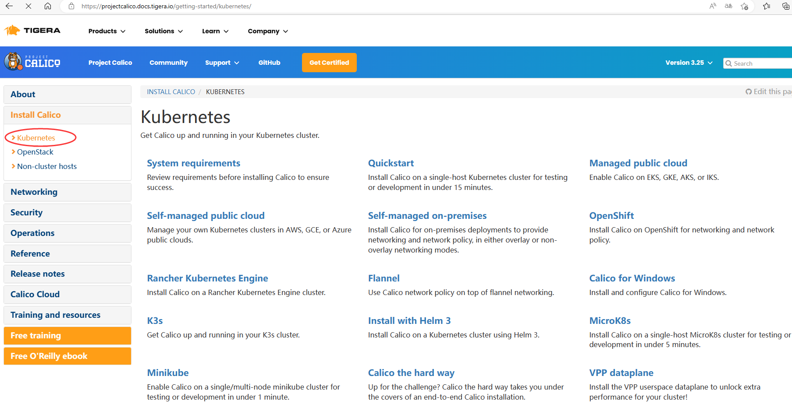
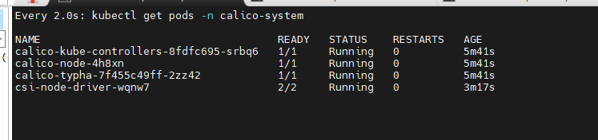

# 一、kubernetes 1.21发布


## 1.1 介绍

2021年04月，Kubernetes 1.21正式与大家见面，这是我们 2021 年的第一个版本！

这个版本包含 51 个增强功能：13 个增强功能升级为稳定版，16 个增强功能升级为 beta 版，20 个增强功能进入 alpha 版，还有 2 个功能已经弃用。

## 1.2 主要变化

### CronJobs 毕业到稳定！

自 Kubernetes 1.8 以来，CronJobs一直是一个测试版功能！在 1.21 中，我们终于看到这个广泛使用的 API 毕业到稳定。

CronJobs 用于执行定期计划的操作，如备份、报告生成等。每个任务都应该被配置为无限期地重复出现（例如：一天/一周/一个月）；你可以在该间隔内定义作业应该启动的时间点。

### 不可变的 Secrets 和 ConfigMaps

Immutable Secrets和ConfigMaps为这些资源类型添加了一个新字段，如果设置了该字段，将拒绝对这些对象的更改。默认情况下，Secrets 和 ConfigMaps 是可变的，这对能够使用更改的 pod 是有益的。如果将错误的配置推送给使用它们的 pod，可变的 Secrets 和 ConfigMaps 也会导致问题。

通过将 Secrets 和 ConfigMaps 标记为不可变的，可以确保应用程序配置不会改变。如果你希望进行更改，则需要创建一个新的、唯一命名的 Secret 或 ConfigMap，并部署一个新的 pod 来消耗该资源。不可变资源也有伸缩性优势，因为控制器不需要轮询 API 服务器来观察变化。

这个特性在 Kubernetes 1.21 中已经毕业到稳定。

### IPv4/IPv6 双栈支持

IP 地址是一种可消耗的资源，集群操作人员和管理员需要确保它不会耗尽。特别是，公共 IPv4 地址现在非常稀少。双栈支持使原生 IPv6 路由到 pod 和服务，同时仍然允许你的集群在需要的地方使用 IPv4。双堆栈集群网络还改善了工作负载的可能伸缩限制。

Kubernetes 的双栈支持意味着 pod、服务和节点可以获得 IPv4 地址和 IPv6 地址。在 Kubernetes 1.21 中，双栈网络已经从 alpha 升级到 beta，并且已经默认启用了。

### 优雅的节点关闭

在这个版本中，优雅的节点关闭也升级到测试版（现在将提供给更大的用户群）！这是一个非常有益的特性，它允许 kubelet 知道节点关闭，并优雅地终止调度到该节点的 pod。

目前，当节点关闭时，pod 不会遵循预期的终止生命周期，也不会正常关闭。这可能会在许多不同的工作负载下带来问题。接下来，kubelet 将能够通过 systemd 检测到即将发生的系统关闭，然后通知正在运行的 pod，以便它们能够尽可能优雅地终止。

### PersistentVolume 健康监测器

持久卷（Persistent Volumes，PV）通常用于应用程序中获取本地的、基于文件的存储。它们可以以许多不同的方式使用，并帮助用户迁移应用程序，而不需要重新编写存储后端。

Kubernetes 1.21 有一个新的 alpha 特性，允许对 PV 进行监视，以了解卷的运行状况，并在卷变得不健康时相应地进行标记。工作负载将能够对运行状况状态作出反应，以保护数据不被从不健康的卷上写入或读取。

### 减少 Kubernetes 的构建维护

以前，Kubernetes 维护了多个构建系统。这常常成为新贡献者和当前贡献者的摩擦和复杂性的来源。

在上一个发布周期中，为了简化构建过程和标准化原生的 Golang 构建工具，我们投入了大量的工作。这应该赋予更广泛的社区维护能力，并降低新贡献者进入的门槛。

## 1.3 重大变化

### 弃用 PodSecurityPolicy

在 Kubernetes 1.21 中，PodSecurityPolicy 已被弃用。与 Kubernetes 所有已弃用的特性一样，PodSecurityPolicy 将在更多版本中继续可用并提供完整的功能。先前处于测试阶段的 PodSecurityPolicy 计划在 Kubernetes 1.25 中删除。

接下来是什么？我们正在开发一种新的内置机制来帮助限制 Pod 权限，暂定名为“PSP 替换策略”。我们的计划是让这个新机制覆盖关键的 PodSecurityPolicy 用例，并极大地改善使用体验和可维护性。

### 弃用 TopologyKeys

服务字段 topologyKeys 现在已弃用；所有使用该字段的组件特性以前都是 alpha 特性，现在也已弃用。我们用一种实现感知拓扑路由的方法替换了 topologyKeys，这种方法称为感知拓扑提示。支持拓扑的提示是 Kubernetes 1.21 中的一个 alpha 特性。你可以在拓扑感知提示中阅读关于替换特性的更多细节；相关的KEP解释了我们替换的背景。

# 二、kubernetes 1.21.0 部署工具介绍

## What is Kubeadm ?

`Kubeadm is a tool built to provide best-practice "fast paths" for creating Kubernetes clusters. It performs the actions necessary to get a minimum viable, secure cluster up and running in a user friendly way. Kubeadm's scope is limited to the local node filesystem and the Kubernetes API, and it is intended to be a composable building block of higher level tools.`

Kubeadm是为创建Kubernetes集群提供最佳实践并能够“快速路径”构建kubernetes集群的工具。它能够帮助我们执行必要的操作，以获得最小可行的、安全的集群，并以用户友好的方式运行。

## Common Kubeadm cmdlets

- **kubeadm init** to bootstrap the initial Kubernetes control-plane node. `初始化`
- **kubeadm join** to bootstrap a Kubernetes worker node or an additional control plane node, and join it to the cluster. `添加工作节点到kubernetes集群`
- **kubeadm upgrade** to upgrade a Kubernetes cluster to a newer version. ` 更新kubernetes版本`
- **kubeadm reset** to revert any changes made to this host by kubeadm init or kubeadm join. ` 重置kubernetes集群`

# 三、kubernetes 1.21.0 部署环境准备

>  3主2从

## 3.1 主机操作系统说明

| 序号 | 操作系统及版本 | 备注 |
| :--: | :------------: | :--: |
|  1   |   CentOS7u9    |      |

## 3.2 主机硬件配置说明

| 序号 | CPU  | 内存 | 硬盘  | 角色         | 主机名   |
| ---- | ---- | ---- | ----- | ------------ | -------- |
| 1    | 4C   | 8G   | 100GB | master       | master01 |
| 2    | 4C   | 8G   | 100GB | master       | master02 |
| 3    | 4C   | 8G   | 100GB | master       | master03 |
| 4    | 4C   | 8G   | 100GB | worker(node) | worker01 |
| 5    | 4C   | 8G   | 100GB | worker(node) | worker02 |

CPU至少2C

```shell
# 查看CPU的核数
lscpu
```

| 序号 | 主机名   | IP地址         | 备注   |
| ---- | -------- | -------------- | ------ |
| 1    | master01 | 192.168.56.21  | master |
| 2    | master02 | 192.168.56.22  | master |
| 3    | master03 | 192.168.56.23  | master |
| 4    | worker01 | 192.168.56.24  | node   |
| 5    | worker02 | 192.168.56.25  | node   |
| 6    | master01 | 192.168.56.100 | vip    |

| 序号 | 主机名   | 功能                | 备注             |
| ---- | -------- | ------------------- | ---------------- |
| 1    | master01 | haproxy、keepalived | keepalived主节点 |
| 2    | master02 | haproxy、keepalived | keepalived从节点 |

## 3.3 主机配置

### 3.3.1 主机名配置

由于本次使用3台主机完成kubernetes集群部署，其中1台为master节点,名称为master01;其中2台为worker节点，名称分别为：worker01及worker02

~~~powershell
master节点,名称为master1
# hostnamectl set-hostname master01
~~~

```powershell
master节点,名称为master2
# hostnamectl set-hostname master02
```

```powershell
master节点,名称为master3
# hostnamectl set-hostname master02
```

```powershell
worker1节点,名称为worker1
# hostnamectl set-hostname worker01
```


~~~powershell
worker2节点,名称为worker2
# hostnamectl set-hostname worker02
~~~

```shell
# 查看相关信息
[root@manager01 ~]# hostnamectl
   Static hostname: manager01
         Icon name: computer-vm
           Chassis: vm
        Machine ID: c478b7ad1448ed4b837062a96c5f53f0
           Boot ID: 40b354603c334f0eb2f5a084162cb024
    Virtualization: kvm
  Operating System: CentOS Linux 7 (Core)
       CPE OS Name: cpe:/o:centos:centos:7
            Kernel: Linux 3.10.0-1127.el7.x86_64
      Architecture: x86-64
```

### 3.3.2 主机IP地址配置

~~~powershell
master01节点IP地址为：192.168.56.21/24
# vim /etc/sysconfig/network-scripts/ifcfg-ens33
TYPE="Ethernet"
PROXY_METHOD="none"
BROWSER_ONLY="no"
BOOTPROTO="none"
DEFROUTE="yes"
IPV4_FAILURE_FATAL="no"
IPV6INIT="yes"
IPV6_AUTOCONF="yes"
IPV6_DEFROUTE="yes"
IPV6_FAILURE_FATAL="no"
IPV6_ADDR_GEN_MODE="stable-privacy"
NAME="ens33"
DEVICE="ens33"
ONBOOT="yes"
IPADDR="192.168.56.21"
PREFIX="24"
GATEWAY="192.168.56.2"
DNS1="119.29.29.29"
~~~

~~~powershell
master02节点IP地址为：192.168.56.22/24
# vim /etc/sysconfig/network-scripts/ifcfg-ens33
TYPE="Ethernet"
PROXY_METHOD="none"
BROWSER_ONLY="no"
BOOTPROTO="none"
DEFROUTE="yes"
IPV4_FAILURE_FATAL="no"
IPV6INIT="yes"
IPV6_AUTOCONF="yes"
IPV6_DEFROUTE="yes"
IPV6_FAILURE_FATAL="no"
IPV6_ADDR_GEN_MODE="stable-privacy"
NAME="ens33"
DEVICE="ens33"
ONBOOT="yes"
IPADDR="192.168.56.22"
PREFIX="24"
GATEWAY="192.168.56.2"
DNS1="119.29.29.29"
~~~

~~~powershell
master03节点IP地址为：192.168.56.23/24
# vim /etc/sysconfig/network-scripts/ifcfg-ens33
TYPE="Ethernet"
PROXY_METHOD="none"
BROWSER_ONLY="no"
BOOTPROTO="none"
DEFROUTE="yes"
IPV4_FAILURE_FATAL="no"
IPV6INIT="yes"
IPV6_AUTOCONF="yes"
IPV6_DEFROUTE="yes"
IPV6_FAILURE_FATAL="no"
IPV6_ADDR_GEN_MODE="stable-privacy"
NAME="ens33"
DEVICE="ens33"
ONBOOT="yes"
IPADDR="192.168.56.23"
PREFIX="24"
GATEWAY="192.168.56.2"
DNS1="119.29.29.29"
~~~

~~~powershell
worker1节点IP地址为：192.168.56.24/24
# vim /etc/sysconfig/network-scripts/ifcfg-ens33
TYPE="Ethernet"
PROXY_METHOD="none"
BROWSER_ONLY="no"
BOOTPROTO="none"
DEFROUTE="yes"
IPV4_FAILURE_FATAL="no"
IPV6INIT="yes"
IPV6_AUTOCONF="yes"
IPV6_DEFROUTE="yes"
IPV6_FAILURE_FATAL="no"
IPV6_ADDR_GEN_MODE="stable-privacy"
NAME="ens33"
DEVICE="ens33"
ONBOOT="yes"
IPADDR="192.168.56.24"
PREFIX="24"
GATEWAY="192.168.56.2"
DNS1="119.29.29.29"
~~~


~~~powershell
worker2节点IP地址为：192.168.56.25/24
# vim /etc/sysconfig/network-scripts/ifcfg-ens33
TYPE="Ethernet"
PROXY_METHOD="none"
BROWSER_ONLY="no"
BOOTPROTO="none"
DEFROUTE="yes"
IPV4_FAILURE_FATAL="no"
IPV6INIT="yes"
IPV6_AUTOCONF="yes"
IPV6_DEFROUTE="yes"
IPV6_FAILURE_FATAL="no"
IPV6_ADDR_GEN_MODE="stable-privacy"
NAME="ens33"
DEVICE="ens33"
ONBOOT="yes"
IPADDR="192.168.56.13"
PREFIX="24"
GATEWAY="192.168.56.2"
DNS1="119.29.29.29"
~~~

### 3.3.3 主机名与IP地址解析

> 所有集群主机均需要进行配置。

~~~powershell
# cat /etc/hosts
127.0.0.1   localhost localhost.localdomain localhost4 localhost4.localdomain4
::1         localhost localhost.localdomain localhost6 localhost6.localdomain6
192.168.56.21 master01
192.168.56.22 master02
192.168.56.23 master03
192.168.56.24 worker01
192.168.56.25 worker02
~~~

### 3.3.4 防火墙配置

> 所有主机均需要操作。

```shell
# 关闭现有防火墙firewalld
systemctl disable firewalld
systemctl stop firewalld
firewall-cmd --state
not running
```

### 3.3.5 SELINUX配置

> 所有主机均需要操作。修改SELinux配置需要重启操作系统。

```shell
sed -ri 's/SELINUX=enforcing/SELINUX=disabled/' /etc/selinux/config
# cat /etc/selinux/config
```

### 3.3.6 时间同步配置

> 所有主机均需要操作。最小化安装系统需要安装ntpdate软件。
> 
> 同步阿里云的时间，要是国际，可以同步goole的时间

```powershell
# 查看 ntpdate 的位置，没有就安装。 yum -y install ntpdate
which ntpdate

# crontab -e
0 */1 * * * /usr/sbin/ntpdate time1.aliyun.com

# crontab -l
```

### 3.3.7 多机互信

~~~powershell
# ssh-keygen
~~~

~~~powershell
[root@master01 ~]# cd /root/.ssh/
[root@master01 .ssh]# ll
total 8
-rw-------. 1 root root 1679 Feb  5 04:10 id_rsa
-rw-r--r--. 1 root root  395 Feb  5 04:10 id_rsa.pub
[root@master01 .ssh]# cp id_rsa.pub authorized_keys
~~~

**注意：如果linux机器是密钥登录，可以切换为密码登录**


> **操作步骤**
>
> 1.使用密钥登录Linux云服务器，设置root密码。
> sudo passwd root
>
> 若密钥文件丢失或损坏，请参考Linux云服务器如何进入单用户模式重置root密码，重置root密码。
>
> 2.使用root身份编辑云服务器的ssh登录方式。
> su root
>
> vi /etc/ssh/sshd_config
>
> 修改如下配置项：
>
> - 把PasswordAuthentication no 改为 PasswordAuthentication yes
>   或去掉PasswordAuthentication yes 前面的#注释掉。
>
> - 把PermitRootLogin no 改为 PermitRootLogin yes
>   或去掉PermitRootLogin yes 前面的#注释掉。
>
> 3.重启sshd使修改生效。
> service sshd restart
>
> 4.重启云服务器就可以使用root用户和新设置的密码登录了。


~~~powershell
将密钥复制到其他主机上
# for i in 22 23 24 25; do scp -r /root/.ssh 192.168.56.$i:/root/; done
~~~


### 3.3.8 升级操作系统内核

> 所有主机均需要操作。

~~~powershell
# 导入elrepo gpg key
rpm --import https://www.elrepo.org/RPM-GPG-KEY-elrepo.org
~~~

~~~powershell
# 安装elrepo YUM源仓库
yum -y install https://www.elrepo.org/elrepo-release-7.0-4.el7.elrepo.noarch.rpm
~~~

~~~powershell
# 查看yum源
yum repolist
~~~

```powershell
# 安装kernel-ml版本，ml为长期稳定版本，lt为长期维护版本
yum --enablerepo="elrepo-kernel" -y install kernel-ml.x86_64
```

~~~powershell
# 设置grub2默认引导为0
grub2-set-default 0
~~~

~~~powershell
# 重新生成grub2引导文件
grub2-mkconfig -o /boot/grub2/grub.cfg
~~~

~~~powershell
# 更新后，需要重启，使用升级的内核生效。
# 可以先不重启，等3.3.10操作完之后在一块重启
reboot
~~~

~~~powershell
# 重启后，需要验证内核是否为更新对应的版本
[root@master01 ~]# uname -r
6.1.8-1.el7.elrepo.x86_64
~~~

### 3.3.9 配置内核转发及网桥过滤

>所有主机均需要操作。

~~~powershell
添加网桥过滤及内核转发配置文件
# cat /etc/sysctl.d/k8s.conf
net.bridge.bridge-nf-call-ip6tables = 1
net.bridge.bridge-nf-call-iptables = 1
net.ipv4.ip_forward = 1
vm.swappiness = 0
~~~

~~~powershell
加载br_netfilter模块
# modprobe br_netfilter
~~~

~~~powershell
查看是否加载
# lsmod | grep br_netfilter
br_netfilter           22256  0
bridge                151336  1 br_netfilter
~~~

~~~powershell
加载网桥过滤及内核转发配置文件
# sysctl -p /etc/sysctl.d/k8s.conf
net.bridge.bridge-nf-call-ip6tables = 1
net.bridge.bridge-nf-call-iptables = 1
net.ipv4.ip_forward = 1
vm.swappiness = 0
~~~

### 3.3.10 安装ipset及ipvsadm

> 所有主机均需要操作。主要用于实现service转发。

~~~powershell
安装ipset及ipvsadm
# yum -y install ipset ipvsadm
~~~

~~~powershell
配置ipvsadm模块加载方式
添加需要加载的模块
# cat > /etc/sysconfig/modules/ipvs.modules <<EOF
#!/bin/bash
modprobe -- ip_vs
modprobe -- ip_vs_rr
modprobe -- ip_vs_wrr
modprobe -- ip_vs_sh
modprobe -- nf_conntrack
EOF
~~~

~~~powershell
授权、运行、检查是否加载
# chmod 755 /etc/sysconfig/modules/ipvs.modules && bash /etc/sysconfig/modules/ipvs.modules && lsmod | grep -e ip_vs -e nf_conntrack
~~~

### 3.3.11 关闭SWAP分区

> 主要是为了提高kubernetes的性能
>
> 修改完成后需要重启操作系统，如不重启，可临时关闭，命令为swapoff -a

~~~powershell
永远关闭swap分区，需要重启操作系统
# cat /etc/fstab
......

# /dev/mapper/centos-swap swap                    swap    defaults        0 0

在上一行中行首添加#
~~~

## 3.4 Docker准备

> 所有集群主机均需操作。

### 3.4.1 获取YUM源

> 使用阿里云开源软件镜像站。

~~~powershell
# wget https://mirrors.aliyun.com/docker-ce/linux/centos/docker-ce.repo -O /etc/yum.repos.d/docker-ce.repo
~~~

### 3.4.2 查看可安装版本

~~~powershell
# yum list docker-ce.x86_64 --showduplicates | sort -r
~~~

### 3.4.3 安装指定版本并设置启动及开机自启动

~~~powershell
# yum -y install --setopt=obsoletes=0 docker-ce-20.10.9-3.el7
~~~

~~~powershell
设置开机自启动
# systemctl enable docker

启动docker
# systemctl start docker
~~~

### 3.4.4 修改cgroup方式

~~~powershell
在/etc/docker/daemon.json添加如下内容

# cat /etc/docker/daemon.json
{
        "exec-opts": ["native.cgroupdriver=systemd"]
}

或者使用下面配置，包含了镜像加速，网络不行的话，使用下面配置
{
  "registry-mirrors": [
        "https://9fgss2yh.mirror.aliyuncs.com",
        "https://registry.docker-cn.com",
        "http://hub-mirror.c.163.com",
        "https://docker.mirrors.ustc.edu.cn"
        ],
  "exec-opts": ["native.cgroupdriver=systemd"],
  "log-driver": "json-file",
  "log-opts": {
    "max-size": "100m"
  },
  "storage-driver": "overlay2",
  "storage-opts": [
    "overlay2.override_kernel_check=true"
  ]
}
~~~

### 3.4.5 重启docker

~~~powershell
# systemctl restart docker
~~~

# 四、HAProxy及Keepalined部署

## 4.1 HAProxy及keepalived安装

在master01 和 master02 节点上安装

~~~powershell
[root@master01 ~]# yum -y install haproxy keepalived
~~~

~~~powershell
[root@master02 ~]# yum -y install haproxy keepalived
~~~

## 4.2 HAProxy配置及启动

~~~powershell
[root@master01 ~]# vim /etc/haproxy/haproxy.cfg
[root@master01 ~]# cat /etc/haproxy/haproxy.cfg
#---------------------------------------------------------------------
# Example configuration for a possible web application.  See the
# full configuration options online.
#
#
#---------------------------------------------------------------------

#---------------------------------------------------------------------
# Global settings
#---------------------------------------------------------------------
global
  maxconn  2000
  ulimit-n  16384
  log  127.0.0.1 local0 err
  stats timeout 30s

defaults
  log global
  mode  http
  option  httplog
  timeout connect 5000
  timeout client  50000
  timeout server  50000
  timeout http-request 15s
  timeout http-keep-alive 15s

frontend monitor-in
  bind *:33305
  mode http
  option httplog
  monitor-uri /monitor

frontend k8s-master
  bind 0.0.0.0:16443
  bind 127.0.0.1:16443
  mode tcp
  option tcplog
  tcp-request inspect-delay 5s
  default_backend k8s-master

backend k8s-master
  mode tcp
  option tcplog
  option tcp-check
  balance roundrobin
  default-server inter 10s downinter 5s rise 2 fall 2 slowstart 60s maxconn 250 maxqueue 256 weight 100
  server master01   192.168.56.21:6443  check
  server master02   192.168.56.22:6443  check
  server master03   192.168.56.23:6443  check
~~~

~~~powershell
[root@master01 ~]# systemctl enable haproxy

[root@master01 ~]# systemctl start haproxy

[root@master01 ~]# systemctl status haproxy
~~~


```powershell
# 将配置文件复制到master02节点上
[root@master01 ~]# scp /etc/haproxy/haproxy.cfg master02:/etc/haproxy/haproxy.cfg

# 在master02 节点上设置开机自动，并启动
[root@master02 ~]# systemctl enable haproxy

[root@master02 ~]# systemctl start haproxy

[root@master02 ~]# systemctl status haproxy
```


## 4.3 Keepalived配置及启动

~~~powershell
[root@master01 ~]# vim /etc/keepalived/keepalived.conf
[root@master01 ~]# cat /etc/keepalived/keepalived.conf
! Configuration File for keepalived
global_defs {
    router_id LVS_DEVEL
script_user root
    enable_script_security
}
vrrp_script chk_apiserver {
    script "/etc/keepalived/check_apiserver.sh" #此脚本需要多独定义，并要调用。
    interval 5
    weight -5
    fall 2
    rise 1
}
vrrp_instance VI_1 {
    state MASTER
    interface eth1 # 修改为正在使用的网卡
    mcast_src_ip 192.168.56.21 #为本master主机对应的IP地址
    virtual_router_id 51
    priority 101
    advert_int 2
    authentication {
        auth_type PASS
        auth_pass abc123
    }
    virtual_ipaddress {
        192.168.56.100 #为VIP地址
    }
    track_script {
       chk_apiserver # 执行上面检查apiserver脚本
    }
}
~~~


~~~powershell
[root@master01 ~]# vim /etc/keepalived/check_apiserver.sh
[root@master01 ~]# cat /etc/keepalived/check_apiserver.sh
#!/bin/bash

err=0
for k in $(seq 1 3)
do
    check_code=$(pgrep haproxy)
    if [[ $check_code == "" ]]; then
        err=$(expr $err + 1)
        sleep 1
        continue
    else
        err=0
        break
    fi
done

if [[ $err != "0" ]]; then
    echo "systemctl stop keepalived"
    /usr/bin/systemctl stop keepalived
    exit 1
else
    exit 0
fi
~~~

~~~powershell
[root@master01 ~]# chmod +x /etc/keepalived/check_apiserver.sh
~~~

将两个文件copy到master02节点上

~~~powershell
# 注意，需要改下配置文件的IP地址
[root@master01 ~]# scp /etc/keepalived/keepalived.conf master02:/etc/keepalived/

[root@master01 ~]# scp /etc/keepalived/check_apiserver.sh master02:/etc/keepalived/
~~~

~~~powershell
[root@master02 ~]# vim /etc/keepalived/keepalived.conf
[root@master02 ~]# cat /etc/keepalived/keepalived.conf
! Configuration File for keepalived
global_defs {
    router_id LVS_DEVEL
script_user root
    enable_script_security
}
vrrp_script chk_apiserver {
    script "/etc/keepalived/check_apiserver.sh" #此脚本需要多独定义，并要调用。
    interval 5
    weight -5
    fall 2
rise 1
}
vrrp_instance VI_1 {
    state BACKUP   # 改成 BACKUP
    interface eth1 # 修改为正在使用的网卡
    mcast_src_ip 192.168.56.22 #为本master主机对应的IP地址
    virtual_router_id 51
    priority 99 # 修改为99
    advert_int 2
    authentication {
        auth_type PASS
        auth_pass abc123
    }
    virtual_ipaddress {
        192.168.56.100 #为VIP地址
    }
    track_script {
       chk_apiserver # 执行上面检查apiserver脚本
    }
}
~~~

~~~powershell
[root@master01 ~]# systemctl enable keepalived

[root@master01 ~]# systemctl start keepalived
~~~

~~~powershell
[root@master02 ~]# systemctl enable keepalived

[root@master02 ~]# systemctl start keepalived
~~~

## 4.4 验证高可用集群可用性

```shell
# 下面多了 192.168.10.100 的设置。但是master02 节点上是没有的
[root@master01 ~]# ip a s eth1
3: eth1: <BROADCAST,MULTICAST,UP,LOWER_UP> mtu 1500 qdisc pfifo_fast state UP group default qlen 1000
    link/ether 08:00:27:74:68:1e brd ff:ff:ff:ff:ff:ff
    inet 192.168.56.21/24 brd 192.168.56.255 scope global noprefixroute eth1
       valid_lft forever preferred_lft forever
    inet 192.168.10.100/32 scope global eth1
       valid_lft forever preferred_lft forever
    inet6 fe80::a00:27ff:fe74:681e/64 scope link
       valid_lft forever preferred_lft forever

# master02 节点上是没有的
[root@master02 ~]# ip a s eth1
3: eth1: <BROADCAST,MULTICAST,UP,LOWER_UP> mtu 1500 qdisc pfifo_fast state UP group default qlen 1000
    link/ether 08:00:27:84:7f:37 brd ff:ff:ff:ff:ff:ff
    inet 192.168.56.22/24 brd 192.168.56.255 scope global noprefixroute eth1
       valid_lft forever preferred_lft forever
    inet6 fe80::a00:27ff:fe84:7f37/64 scope link
       valid_lft forever preferred_lft forever

```

```shell
[root@master01 ~]# ss -anput | grep ":16443"
tcp    LISTEN     0      2000   127.0.0.1:16443                 *:*                   users:(("haproxy",pid=1725,fd=6))
tcp    LISTEN     0      2000      *:16443                 *:*                   users:(("haproxy",pid=1725,fd=5))


[root@master02 ~]# ss -anput | grep ":16443"
tcp    LISTEN     0      2000   127.0.0.1:16443                 *:*                   users:(("haproxy",pid=1673,fd=6))
tcp    LISTEN     0      2000      *:16443                 *:*                   users:(("haproxy",pid=1673,fd=5))
```

# 五、kubernetes 1.21.0  集群部署

## 5.1 集群软件版本说明

|          | kubeadm                | kubelet                                       | kubectl                |
| -------- | ---------------------- | --------------------------------------------- | ---------------------- |
| 版本     | 1.21.0                 | 1.21.0                                        | 1.21.0                 |
| 安装位置 | 集群所有主机           | 集群所有主机                                  | 集群所有主机           |
| 作用     | 初始化集群、管理集群等 | 用于接收api-server指令，对pod生命周期进行管理 | 集群应用命令行管理工具 |

## 5.2 kubernetes YUM源准备

> 所有集群主机均需操作。
>
> 在/etc/yum.repos.d/目录中创建k8s.repo文件，把下面内容复制进去即可。

### 5.2.1 谷歌YUM源

~~~powershell
# vim /etc/yum.repos.d/k8s.repo
[kubernetes]
name=Kubernetes
baseurl=https://packages.cloud.google.com/yum/repos/kubernetes-el7-x86_64
enabled=1
gpgcheck=1
repo_gpgcheck=1
gpgkey=https://packages.cloud.google.com/yum/doc/yum-key.gpg
        https://packages.cloud.google.com/yum/doc/rpm-package-key.gpg
~~~

### 5.2.2 阿里云YUM源

~~~powershell
# vim /etc/yum.repos.d/k8s.repo
[kubernetes]
name=Kubernetes
baseurl=https://mirrors.aliyun.com/kubernetes/yum/repos/kubernetes-el7-x86_64/
enabled=1
gpgcheck=1
repo_gpgcheck=1
gpgkey=https://mirrors.aliyun.com/kubernetes/yum/doc/yum-key.gpg https://mirrors.aliyun.com/kubernetes/yum/doc/rpm-package-key.gpg
~~~

> 设置好之后，可以使用 yum repolist 查看下

```shell
# 如果显示是这样，则说明又冲突，把之前的删掉
[root@master01 ~]# yum repolist
Loaded plugins: fastestmirror
Existing lock /var/run/yum.pid: another copy is running as pid 13178.
Another app is currently holding the yum lock; waiting for it to exit...
  The other application is: yum
    Memory :  45 M RSS (818 MB VSZ)
    Started: Sat Feb  4 12:55:03 2023 - 00:47 ago
    State  : Sleeping, pid: 13178
Another app is currently holding the yum lock; waiting for it to exit...
  The other application is: yum
    Memory :  45 M RSS (818 MB VSZ)
    Started: Sat Feb  4 12:55:03 2023 - 00:49 ago
    State  : Sleeping, pid: 13178
Another app is currently holding the yum lock; waiting for it to exit...
  The other application is: yum
    Memory :  45 M RSS (818 MB VSZ)
    Started: Sat Feb  4 12:55:03 2023 - 00:51 ago
    State  : Sleeping, pid: 13178
Another app is currently holding the yum lock; waiting for it to exit...
  The other application is: yum
    Memory :  45 M RSS (818 MB VSZ)
    Started: Sat Feb  4 12:55:03 2023 - 00:53 ago
    State  : Sleeping, pid: 13178
^C

Exiting on user cancel.
# 删掉
[root@master01 ~]# rm -f /var/run/yum.pid
```

 ### 5.2.3 镜像加速

有些镜像下载很慢，修改/etc/docker/daemon.json配置文件（没有就新建）

```json
{
  "registry-mirrors": [
        "https://9fgss2yh.mirror.aliyuncs.com",
        "https://registry.docker-cn.com",
        "http://hub-mirror.c.163.com",
        "https://docker.mirrors.ustc.edu.cn"
        ],
  "exec-opts": ["native.cgroupdriver=systemd"],
  "log-driver": "json-file",
  "log-opts": {
    "max-size": "100m"
  },
  "storage-driver": "overlay2",
  "storage-opts": [
    "overlay2.override_kernel_check=true"
  ]
}
```

## 5.3 集群软件安装

> 所有集群主机均需操作。

~~~powershell
查看指定版本
# yum list kubeadm.x86_64 --showduplicates | sort -r
# yum list kubelet.x86_64 --showduplicates | sort -r
# yum list kubectl.x86_64 --showduplicates | sort -r
~~~

~~~powershell
安装指定版本
# yum -y install --setopt=obsoletes=0 kubeadm-1.21.0-0  kubelet-1.21.0-0 kubectl-1.21.0-0
~~~

## 5.4 配置kubelet

>所有集群主机均需操作。
>
>为了实现docker使用的cgroupdriver与kubelet使用的cgroup的一致性，建议修改如下文件内容。

~~~powershell
# vim /etc/sysconfig/kubelet
KUBELET_EXTRA_ARGS="--cgroup-driver=systemd"
~~~

~~~powershell
设置kubelet为开机自启动即可，由于没有生成配置文件，集群初始化后自动启动
# systemctl enable kubelet
~~~

## 5.5 集群镜像准备

> 所有集群主机均需操作。
>
> 可使用VPN实现下载。

~~~powershell
# kubeadm config images list --kubernetes-version=v1.21.0
k8s.gcr.io/kube-apiserver:v1.21.0
k8s.gcr.io/kube-controller-manager:v1.21.0
k8s.gcr.io/kube-scheduler:v1.21.0
k8s.gcr.io/kube-proxy:v1.21.0
k8s.gcr.io/pause:3.4.1
k8s.gcr.io/etcd:3.4.13-0
k8s.gcr.io/coredns/coredns:v1.8.0
~~~

~~~powershell
# cat image_download.sh
#!/bin/bash
images_list='
k8s.gcr.io/kube-apiserver:v1.21.0
k8s.gcr.io/kube-controller-manager:v1.21.0
k8s.gcr.io/kube-scheduler:v1.21.0
k8s.gcr.io/kube-proxy:v1.21.0
k8s.gcr.io/pause:3.4.1
k8s.gcr.io/etcd:3.4.13-0
k8s.gcr.io/coredns/coredns:v1.8.0'

for i in $images_list
do
        docker pull $i
done

docker save -o k8s-1-21-0.tar $images_list
~~~

国内不能直接访问 [https://k8s.gcr.io/v2/](https://gitee.com/link?target=https%3A%2F%2Fk8s.gcr.io%2Fv2%2F)"

我们可以找能下的镜像

```shell
# cat image_download.sh
#!/bin/bash
set -o errexit
set -o nounset
set -o pipefail

##这里定义版本，按照上面得到的列表自己改一下版本号

KUBE_VERSION=v1.21.0
KUBE_PAUSE_VERSION=3.4.1
ETCD_VERSION=3.4.13-0
# DNS_VERSION=1.8.0 # coredns需要特殊处理

##这是原始仓库名，最后需要改名成这个
GCR_URL=k8s.gcr.io

##这里就是写你要使用的仓库
DOCKERHUB_URL=gotok8s

##这里是镜像列表，新版本要把coredns需要特殊处理
images=(
kube-proxy:${KUBE_VERSION}
kube-scheduler:${KUBE_VERSION}
kube-controller-manager:${KUBE_VERSION}
kube-apiserver:${KUBE_VERSION}
pause:${KUBE_PAUSE_VERSION}
etcd:${ETCD_VERSION}
 # coredns:${DNS_VERSION}  # coredns需要特殊处理
)

##这里是拉取和改名的循环语句
for imageName in ${images[@]} ; do
  docker pull $DOCKERHUB_URL/$imageName
  docker tag $DOCKERHUB_URL/$imageName $GCR_URL/$imageName
  docker rmi $DOCKERHUB_URL/$imageName
done
```

拉取coredns

```shell
docker pull coredns/coredns:1.8.0

# 打标签
docker tag  coredns/coredns:1.8.0 k8s.gcr.io/coredns/coredns:v1.8.0

# 删掉镜像
docker rmi coredns/coredns:1.8.0
```

## 5.6 集群初始化

> 阿里云镜像仓库中的CoreDNS镜像下载有错误。

~~~powershell
[root@master01 ~]# vim kubeadm-config.yaml
[root@master01 ~]# cat kubeadm-config.yaml
apiVersion: kubeadm.k8s.io/v1beta2
bootstrapTokens:
- groups:
  - system:bootstrappers:kubeadm:default-node-token
  token: 7t2weq.bjbawausm0jaxury
  ttl: 24h0m0s
  usages:
  - signing
  - authentication
kind: InitConfiguration
localAPIEndpoint:
  advertiseAddress: 192.168.56.21
  bindPort: 6443
nodeRegistration:
  criSocket: /var/run/dockershim.sock
  name: master01
  taints:
  - effect: NoSchedule
    key: node-role.kubernetes.io/master
---
apiServer:
  certSANs:
  - 192.168.56.100
  timeoutForControlPlane: 4m0s
apiVersion: kubeadm.k8s.io/v1beta2
certificatesDir: /etc/kubernetes/pki
clusterName: kubernetes
controlPlaneEndpoint: 192.168.56.100:16443
controllerManager: {}
dns:
  type: CoreDNS
etcd:
  local:
    dataDir: /var/lib/etcd
imageRepository: registry.cn-hangzhou.aliyuncs.com/google_containers
kind: ClusterConfiguration
kubernetesVersion: v1.21.0
networking:
  dnsDomain: cluster.local
  podSubnet: 10.244.0.0/16
  serviceSubnet: 10.96.0.0/12
scheduler: {}
~~~

~~~powershell
# 使用这个配置，imageRepository 不设置，让其使用默认的
[root@master01 ~]# vim kubeadm-config.yaml
[root@master01 ~]# cat kubeadm-config.yaml
apiVersion: kubeadm.k8s.io/v1beta2
bootstrapTokens:
- groups:
  - system:bootstrappers:kubeadm:default-node-token
  token: 7t2weq.bjbawausm0jaxury
  ttl: 24h0m0s
  usages:
  - signing
  - authentication
kind: InitConfiguration
localAPIEndpoint:
  advertiseAddress: 192.168.56.21
  bindPort: 6443
nodeRegistration:
  criSocket: /var/run/dockershim.sock
  name: master01
  taints:
  - effect: NoSchedule
    key: node-role.kubernetes.io/master
---
apiServer:
  certSANs:
  - 192.168.56.100
  timeoutForControlPlane: 4m0s
apiVersion: kubeadm.k8s.io/v1beta2
certificatesDir: /etc/kubernetes/pki
clusterName: kubernetes
controlPlaneEndpoint: 192.168.56.100:16443
controllerManager: {}
dns:
  type: CoreDNS
etcd:
  local:
    dataDir: /var/lib/etcd
imageRepository: 
kind: ClusterConfiguration
kubernetesVersion: v1.21.0
networking:
  dnsDomain: cluster.local
  podSubnet: 10.244.0.0/16
  serviceSubnet: 10.96.0.0/12
scheduler: {}
~~~

~~~powershell
# 查看下版本
[root@master01 ~]# kubeadm config images list --config kubeadm-config.yaml
k8s.gcr.io/kube-apiserver:v1.21.0
k8s.gcr.io/kube-controller-manager:v1.21.0
k8s.gcr.io/kube-scheduler:v1.21.0
k8s.gcr.io/kube-proxy:v1.21.0
k8s.gcr.io/pause:3.4.1
k8s.gcr.io/etcd:3.4.13-0
k8s.gcr.io/coredns/coredns:v1.8.0

# 初始化
[root@master01 ~]# kubeadm init --config /root/kubeadm-config.yaml --upload-certs

# 如果后面网络，可以重置
kubeadm reset
~~~

~~~powershell
初始化输出的内容，一定保留，便于后继操作使用。
Your Kubernetes control-plane has initialized successfully!

To start using your cluster, you need to run the following as a regular user:

  mkdir -p $HOME/.kube
  sudo cp -i /etc/kubernetes/admin.conf $HOME/.kube/config
  sudo chown $(id -u):$(id -g) $HOME/.kube/config

Alternatively, if you are the root user, you can run:

  export KUBECONFIG=/etc/kubernetes/admin.conf

You should now deploy a pod network to the cluster.
Run "kubectl apply -f [podnetwork].yaml" with one of the options listed at:
  https://kubernetes.io/docs/concepts/cluster-administration/addons/

You can now join any number of the control-plane node running the following command on each as root:

  kubeadm join 192.168.56.100:16443 --token 7t2weq.bjbawausm0jaxury \
        --discovery-token-ca-cert-hash sha256:316e8e69dcf43bc72d21be5ab658603e2790724757e593afd22490a6b8357b67 \
        --control-plane --certificate-key 34a99dd24370041bcd255431becfe5c456c9b9cce480c492a4026bd668dd7a2e

Please note that the certificate-key gives access to cluster sensitive data, keep it secret!
As a safeguard, uploaded-certs will be deleted in two hours; If necessary, you can use
"kubeadm init phase upload-certs --upload-certs" to reload certs afterward.

Then you can join any number of worker nodes by running the following on each as root:

kubeadm join 192.168.56.100:16443 --token 7t2weq.bjbawausm0jaxury \
        --discovery-token-ca-cert-hash sha256:316e8e69dcf43bc72d21be5ab658603e2790724757e593afd22490a6b8357b67

~~~

## 5.7 集群应用客户端管理集群文件准备

按照上面的日志，先执行下面操作

```shell
[root@master01 ~]# mkdir -p $HOME/.kube
[root@master01 ~]# cp -i /etc/kubernetes/admin.conf $HOME/.kube/config
[root@master01 ~]# chown $(id -u):$(id -g) $HOME/.kube/config
[root@master01 ~]# export KUBECONFIG=/etc/kubernetes/admin.conf
```

```shell
# 查看nodes，可以看到master01 节点的状态是 NotReady，这是因为我们还没有安装网络插件
[root@master01 ~]# kubectl get nodes
NAME       STATUS     ROLES                  AGE   VERSION
master01   NotReady   control-plane,master   92s   v1.21.0
```

## 5.8 集群网络准备

> 使用calico部署集群网络
>
> 安装参考网址：https://projectcalico.docs.tigera.io/about/about-calico

### 5.8.1 calico安装

> 所有集群主机均需操作。





~~~powershell
安装 Tigera Calico 运算符和自定义资源定义。
# kubectl create -f https://raw.githubusercontent.com/projectcalico/calico/v3.25.0/manifests/tigera-operator.yaml

# 或者

下载operator资源清单文件
# wget https://docs.projectcalico.org/manifests/tigera-operator.yaml

应用资源清单文件，创建operator
kubectl create -f tigera-operator.yaml
~~~

```shell
通过自定义资源方式安装
# wget https://docs.projectcalico.org/manifests/custom-resources.yaml --no-check-certificate
```

```powershell
修改文件第13行，修改为使用kubeadm init ----pod-network-cidr对应的IP地址段
# vim custom-resources.yaml
......
 11     ipPools:
 12     - blockSize: 26
 13       cidr: 10.244.0.0/16 
 14       encapsulation: VXLANCrossSubnet
......
```

~~~powershell
应用资源清单文件
# kubectl apply -f custom-resources.yaml
~~~

~~~powershell
监视calico-system命名空间中pod运行情况
# watch kubectl get pods -n calico-system
~~~

>Wait until each pod has the `STATUS` of `Running`.

~~~powershell
删除 master 上的 taint
# kubectl taint nodes --all node-role.kubernetes.io/master-
~~~




> 监控过程中，如果发现上面的status没有Running
>
> 可以使用 `kubectl describe pod calico-node-4h8xn -n calico-system` 查看某个pod的详细描述信息

如果镜像下载慢，可以提前先把需要的镜像全部下载（**所有机器都下载**）之后，在执行上面的 `kubectl apply -f custom-resources.yaml`

需要下面这些个镜像

```shell
# 注意版本，我上面下载的calico的tigera-operator.yaml是用的 v3.25.0 的版本
docker pull calico/kube-controllers:v3.25.0
docker pull calico/node:v3.25.0
docker pull calico/typha:v3.25.0
docker pull calico/pod2daemon-flexvol:v3.25.0
docker pull calico/cni:v3.25.0
docker pull calico/csi:v3.25.0
docker pull calico/node-driver-registrar:v3.25.0
```

**注意：如果是因为镜像下载的原因没有启动成功，下载了镜像之后，还没有变成功，可以先把之前的pod删掉，会自动重启一个新的pod**

```shell
# 删除pod。pod 后面跟上pod的name
kubectl delete pod [pod_name] -n calico-system
```

~~~powershell
已经全部运行
# kubectl get pod -n calico-system
NAME                                     READY   STATUS    RESTARTS   AGE
calico-kube-controllers-8fdfc695-srbq6   1/1     Running   0          14m
calico-node-4h8xn                        1/1     Running   0          14m
calico-typha-7f455c49ff-2zz42            1/1     Running   0          14m
csi-node-driver-wqnw7                    2/2     Running   0          12m
~~~

~~~powershell
查看kube-system命名空间中coredns状态，处于Running状态表明联网成功。
# kubectl get pods -n kube-system
NAME                               READY   STATUS    RESTARTS   AGE
coredns-558bd4d5db-l4llf           1/1     Running   0          37m
coredns-558bd4d5db-pdp2d           1/1     Running   0          37m
etcd-master01                      1/1     Running   0          38m
kube-apiserver-master01            1/1     Running   0          38m
kube-controller-manager-master01   1/1     Running   0          38m
kube-proxy-5nvpf                   1/1     Running   0          37m
kube-scheduler-master01            1/1     Running   0          38m
~~~

```powershell
查看node节点的状态，变成了Ready
# kubectl get nodes
NAME       STATUS   ROLES                  AGE   VERSION
master01   Ready    control-plane,master   39m   v1.21.0
```

### 5.8.2 calico客户端安装


github下载加速

https://cloud.tencent.com/developer/article/1690290

https://d.serctl.com/

```shell
# 下载二进制。或者使用百度云下载：链接：https://pan.baidu.com/s/1EPWqHNrFFvQd_beSWkaLlA?pwd=jn1y 提取码：jn1y
curl -L https://github.com/projectcalico/calico/releases/download/v3.25.0/calicoctl-linux-amd64 -o calicoctl

# 安装calicoctl
mv calicoctl /usr/bin/

# 为calicoctl添加可执行权限
chmod +x /usr/bin/calicoctl

# 查看添加权限后文件
[root@master01 vagrant]# ls /usr/bin/calicoctl
/usr/bin/calicoctl

# 查看calicoctl版本
[root@master01 vagrant]# calicoctl  version
Client Version:    v3.25.0
Git commit:        3f7fe4d29
Cluster Version:   v3.25.0
Cluster Type:      k8s,bgp,kubeadm,kdd

# 通过~/.kube/config连接kubernetes集群，查看已运行节点
[root@master01 calicoDir]# DATASTORE_TYPE=kubernetes KUBECONFIG=~/.kube/config calicoctl get nodes
NAME
master01
```

## 5.9 集群其它Master节点加入集群

~~~powershell
[root@master02 ~]# kubeadm join 192.168.56.100:16443 --token 7t2weq.bjbawausm0jaxury \
        --discovery-token-ca-cert-hash sha256:316e8e69dcf43bc72d21be5ab658603e2790724757e593afd22490a6b8357b67 \
        --control-plane --certificate-key 34a99dd24370041bcd255431becfe5c456c9b9cce480c492a4026bd668dd7a2e
~~~

~~~powershell
[root@master03 ~]# kubeadm join 192.168.56.100:16443 --token 7t2weq.bjbawausm0jaxury \
        --discovery-token-ca-cert-hash sha256:316e8e69dcf43bc72d21be5ab658603e2790724757e593afd22490a6b8357b67 \
        --control-plane --certificate-key 34a99dd24370041bcd255431becfe5c456c9b9cce480c492a4026bd668dd7a2e
~~~

## 5.10 集群工作节点加入集群

> 因容器镜像下载较慢，可能会导致报错，主要错误为没有准备好cni（集群网络插件），如有网络，请耐心等待即可。

~~~powershell
[root@worker01 ~]# kubeadm join 192.168.56.100:16443 --token 7t2weq.bjbawausm0jaxury \
        --discovery-token-ca-cert-hash sha256:316e8e69dcf43bc72d21be5ab658603e2790724757e593afd22490a6b8357b67
~~~

~~~powershell
[root@worker02 ~]# kubeadm join 192.168.56.100:16443 --token 7t2weq.bjbawausm0jaxury \
        --discovery-token-ca-cert-hash sha256:316e8e69dcf43bc72d21be5ab658603e2790724757e593afd22490a6b8357b67
~~~

## 5.11 验证集群可用性

~~~powershell
查看所有的节点
[root@master01 ~]# kubectl get nodes
NAME       STATUS   ROLES                  AGE     VERSION
master01   Ready    control-plane,master   13m     v1.21.0
master02   Ready    control-plane,master   2m25s   v1.21.0
master03   Ready    control-plane,master   87s     v1.21.0
worker01   Ready    <none>                 3m13s   v1.21.0
worker02   Ready    <none>                 2m50s   v1.21.0
~~~

~~~powershell
查看集群健康情况,理想状态
[root@master01 ~]# kubectl get cs
NAME                 STATUS    MESSAGE             ERROR
controller-manager   Healthy   ok
scheduler            Healthy   ok
etcd-0               Healthy   {"health":"true"}
~~~

~~~powershell
真实情况
# kubectl get cs
Warning: v1 ComponentStatus is deprecated in v1.19+
NAME                 STATUS      MESSAGE                                                                                       ERROR
scheduler            Unhealthy   Get "http://127.0.0.1:10251/healthz": dial tcp 127.0.0.1:10251: connect: connection refused
controller-manager   Unhealthy   Get "http://127.0.0.1:10252/healthz": dial tcp 127.0.0.1:10252: connect: connection refused
etcd-0               Healthy     {"health":"true"}
~~~

~~~powershell
查看kubernetes集群pod运行情况
[root@master01 ~]# kubectl get pods -n kube-system
NAME                               READY   STATUS    RESTARTS   AGE
coredns-558bd4d5db-smp62           1/1     Running   0          13m
coredns-558bd4d5db-zcmp5           1/1     Running   0          13m
etcd-master01                      1/1     Running   0          14m
etcd-master02                      1/1     Running   0          3m10s
etcd-master03                      1/1     Running   0          115s
kube-apiserver-master01            1/1     Running   0          14m
kube-apiserver-master02            1/1     Running   0          3m13s
kube-apiserver-master03            1/1     Running   0          116s
kube-controller-manager-master01   1/1     Running   1          13m
kube-controller-manager-master02   1/1     Running   0          3m13s
kube-controller-manager-master03   1/1     Running   0          116s
kube-proxy-629zl                   1/1     Running   0          2m17s
kube-proxy-85qn8                   1/1     Running   0          3m15s
kube-proxy-fhqzt                   1/1     Running   0          13m
kube-proxy-jdxbd                   1/1     Running   0          3m40s
kube-proxy-ks97x                   1/1     Running   0          4m3s
kube-scheduler-master01            1/1     Running   1          13m
kube-scheduler-master02            1/1     Running   0          3m13s
kube-scheduler-master03            1/1     Running   0          115s

~~~

~~~powershell
再次查看calico-system命名空间中pod运行情况。
[root@master01 ~]# kubectl get pod -n calico-system
NAME                                      READY   STATUS    RESTARTS   AGE
calico-kube-controllers-666bb9949-4z77k   1/1     Running   0          10m
calico-node-b5wjv                         1/1     Running   0          10m
calico-node-d427l                         1/1     Running   0          4m45s
calico-node-jkq7f                         1/1     Running   0          2m59s
calico-node-wtjnm                         1/1     Running   0          4m22s
calico-node-xxh2p                         1/1     Running   0          3m57s
calico-typha-7cd9d6445b-5zcg5             1/1     Running   0          2m54s
calico-typha-7cd9d6445b-b5d4j             1/1     Running   0          10m
calico-typha-7cd9d6445b-z44kp             1/1     Running   1          4m17s
~~~

~~~powershell
在master节点上操作，查看网络节点是否添加
[root@master01 ~]# DATASTORE_TYPE=kubernetes KUBECONFIG=~/.kube/config calicoctl get nodes
NAME
master01
master02
master03
worker01
worker02
~~~
