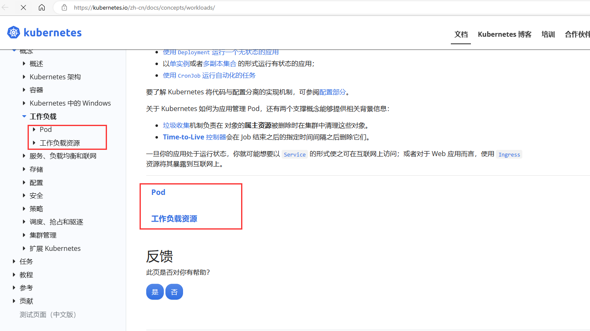

# Kubernetes集群核心概念 Pod

# 一、工作负载(workloads)

参考链接：https://kubernetes.io/zh/docs/concepts/workloads/

工作负载（workload）是在kubernetes集群中运行的应用程序。无论你的工作负载是单一服务还是多个一同工作的服务构成，在kubernetes中都可以使用pod来运行它。




workloads分为pod与controllers

- pod通过控制器实现应用的运行，如何伸缩，升级等
- controllers 在集群中管理pod
- pod与控制器之间通过label-selector相关联，是唯一的关联方式


在pod的YAML里指定pod标签

~~~powershell
定义标签
  labels: 
	app: nginx
~~~


在控制器的YAML里指定标签选择器匹配标签

~~~powershell
通过标签选择器选择对应的pod
  selector:
    matchLabels:
      app: nginx
~~~


# 二、pod介绍

## 2.1 pod定义与分类

参考链接: https://kubernetes.io/zh/docs/concepts/workloads/pods/

### 2.1.1 Pod定义

* Pod(豌豆荚) 是Kubernetes集群管理（创建、部署）与调度的最小计算单元，表示处于运行状态的一组容器。
* Pod不是进程，而是容器运行的环境。
* 一个Pod可以封装**一个容器或多个容器(主容器或sidecar边车容器)**
* 一个pod内的多个容器之间共享部分命名空间，例如：Net Namespace,UTS Namespace,IPC Namespace及存储资源
* 用户pod默认会被调度运行在node节点之上(不运行在master节点上，但也有例外情况)
* pod内的IP不是固定的，集群外不能直接访问pod


### 2.1.2 Pod分类

* **静态Pod**	也称之为“无控制器管理的自主式pod”，直接由特定节点上的 `kubelet` 守护进程管理， 不需要API 服务器看到它们，尽管大多数 Pod 都是通过控制面（例如，Deployment） 来管理的，对于静态 Pod 而言，`kubelet` 直接监控每个 Pod，并在其失效时重启之。
* **控制器管理的pod**   控制器可以控制pod的副本数，扩容与裁剪，版本更新与回滚等


## 2.2 查看pod方法

pod是一种计算资源，可以通过`kubectl get pod`来查看

~~~powershell
[root@k8s-master1 ~]# kubectl get pod		# pod或pods都可以，不指定namespace,默认是名为default的namespace
	
[root@k8s-master1 ~]# kubectl get pod -n kube-system
~~~


## 2.3 pod的YAML资源清单格式

先看一个yaml格式的pod定义文件解释

~~~powershell
# yaml格式的pod定义文件完整内容：
apiVersion: v1       #必选，api版本号，例如v1
kind: Pod       	#必选，Pod
metadata:       	#必选，元数据
  name: string       #必选，Pod名称
  namespace: string    #Pod所属的命名空间,默认在default的namespace
  labels:     		 # 自定义标签
    name: string     #自定义标签名字
  annotations:        #自定义注释列表
    name: string
spec:         #必选，Pod中容器的详细定义(期望)
  containers:      #必选，Pod中容器列表
  - name: string     #必选，容器名称
    image: string    #必选，容器的镜像名称
    imagePullPolicy: [Always | Never | IfNotPresent] #获取镜像的策略 Alawys表示下载镜像 IfnotPresent表示优先使用本地镜像，否则下载镜像，Nerver表示仅使用本地镜像
    command: [string]    #容器的启动命令列表，如不指定，使用打包时使用的启动命令
    args: [string]     #容器的启动命令参数列表
    workingDir: string     #容器的工作目录
    volumeMounts:    #挂载到容器内部的存储卷配置
    - name: string     #引用pod定义的共享存储卷的名称，需用volumes[]部分定义的的卷名
      mountPath: string    #存储卷在容器内mount的绝对路径，应少于512字符
      readOnly: boolean    #是否为只读模式
    ports:       #需要暴露的端口库号列表
    - name: string     #端口号名称
      containerPort: int   #容器需要监听的端口号
      hostPort: int    #容器所在主机需要监听的端口号，默认与Container相同
      protocol: string     #端口协议，支持TCP和UDP，默认TCP
    env:       #容器运行前需设置的环境变量列表
    - name: string     #环境变量名称
      value: string    #环境变量的值
    resources:       #资源限制和请求的设置
      limits:      #资源限制的设置
        cpu: string    #Cpu的限制，单位为core数，将用于docker run --cpu-shares参数
        memory: string     #内存限制，单位可以为Mib/Gib，将用于docker run --memory参数
      requests:      #资源请求的设置
        cpu: string    #Cpu请求，容器启动的初始可用数量
        memory: string     #内存清求，容器启动的初始可用数量
    livenessProbe:     #对Pod内个容器健康检查的设置，当探测无响应几次后将自动重启该容器，检查方法有exec、httpGet和tcpSocket，对一个容器只需设置其中一种方法即可
      exec:      #对Pod容器内检查方式设置为exec方式
        command: [string]  #exec方式需要制定的命令或脚本
      httpGet:       #对Pod内个容器健康检查方法设置为HttpGet，需要制定Path、port
        path: string
        port: number
        host: string
        scheme: string
        HttpHeaders:
        - name: string
          value: string
      tcpSocket:     #对Pod内个容器健康检查方式设置为tcpSocket方式
         port: number
       initialDelaySeconds: 0  #容器启动完成后首次探测的时间，单位为秒
       timeoutSeconds: 0   #对容器健康检查探测等待响应的超时时间，单位秒，默认1秒
       periodSeconds: 0    #对容器监控检查的定期探测时间设置，单位秒，默认10秒一次
       successThreshold: 0
       failureThreshold: 0
       securityContext:
         privileged:false
    restartPolicy: [Always | Never | OnFailure] # Pod的重启策略，Always表示一旦不管以何种方式终止运行，kubelet都将重启，OnFailure表示只有Pod以非0退出码退出才重启，Nerver表示不再重启该Pod
    nodeSelector: obeject  # 设置NodeSelector表示将该Pod调度到包含这个label的node上，以key：value的格式指定
    imagePullSecrets:    #Pull镜像时使用的secret名称，以key：secretkey格式指定
    - name: string
    hostNetwork: false     #是否使用主机网络模式，默认为false，如果设置为true，表示使用宿主机网络
    volumes:       #在该pod上定义共享存储卷列表
    - name: string     #共享存储卷名称 （volumes类型有很多种）
      emptyDir: {}     #类型为emtyDir的存储卷，与Pod同生命周期的一个临时目录。为空值
      hostPath: string     #类型为hostPath的存储卷，表示挂载Pod所在宿主机的目录
        path: string     #Pod所在宿主机的目录，将被用于同期中mount的目录
      secret:      #类型为secret的存储卷，挂载集群与定义的secret对象到容器内部
        scretname: string  
        items:     
        - key: string
          path: string
      configMap:     #类型为configMap的存储卷，挂载预定义的configMap对象到容器内部
        name: string
        items:
        - key: string
          path: string
~~~


**YAML格式查找帮助方法回顾**

~~~powershell
[root@k8s-master1 ~]# kubectl explain namespace

[root@k8s-master1 ~]# kubectl explain pod
[root@k8s-master1 ~]# kubectl explain pod.spec
[root@k8s-master1 ~]# kubectl explain pod.spec.containers
~~~


# 三、pod创建与验证

## 3.1 命令创建pod(v1.18变化)

- k8s之前版本中, kubectl run命令用于创建deployment控制器
- 在v1.18版本中, kubectl run命令改为创建pod

### 3.1.1 创建一个名为pod-nginx的pod

```powershell
# 查看帮助
[root@k8s-master1 ~]# kubectl run -h

# 不建议使用命令行的方式创建，建议使用YAML的方式
[root@k8s-master1 ~]# kubectl run nginx1 --image=nginx:1.15-alpine
pod/nginx1 created
```

### 3.1.2 验证

```powershell
# STATUS 是指的pod的运行状态，不是pod里面容器的运行状态
[root@k8s-master1 ~]# kubectl get pods
NAME             READY   STATUS    RESTARTS   AGE
nginx1           1/1     Running   0          41s
```


## 3.2 YAML创建pod

### 3.2.1 准备yaml文件

~~~powershell
[root@k8s-master1 ~]# vim pod-stress.yml
apiVersion: v1					# api版本
kind: Pod						# 资源类型为Pod
metadata:						
  name: pod-stress				# 自定义pod的名称
spec:
  containers:					# 定义pod里包含的容器
  - name: c1					# 自定义pod中的容器名
    image: polinux/stress		# 启动容器的镜像名
    command: ["stress"]			# 自定义启动容器时要执行的命令(类似dockerfile里的CMD)
    args: ["--vm", "1", "--vm-bytes", "150M", "--vm-hang", "1"] # 自定义启动容器执行命令的参数
    
# polinux/stress这个镜像用于压力测试,在启动容器时传命令与参数就是相当于分配容器运行时需要的压力
~~~

2, 通过yaml文件创建pod

```powershell
[root@k8s-master1 ~]# kubectl apply -f pod1.yml
pod/pod-stress created
```


### 3.2.2 查看pod信息

查看pod信息

```powershell
[root@k8s-master1 ~]# kubectl get pod
NAME          READY   STATUS    RESTARTS   AGE
pod-stress    1/1     Running   0          45s
```

查看pod详细信息

```powershell
[root@k8s-master1 ~]# kubectl get pods -o wide
NAME         READY   STATUS    RESTARTS   AGE   IP              NODE          NOMINATED NODE   READINESS GATES
pod-stress   1/1     Running   0          71s   10.244.194.72   k8s-worker1   <none>           <none>
```

描述pod详细信息

```powershell
[root@k8s-master1 ~]# kubectl describe pod pod-stress 
......
Events:
  Type    Reason     Age   From               Message
  ----    ------     ----  ----               -------
  Normal  Scheduled  102s  default-scheduler  Successfully assigned default/pod-stress to k8s-worker1
  Normal  Pulling    102s  kubelet            Pulling image "polinux/stress"
  Normal  Pulled     83s   kubelet            Successfully pulled image "polinux/stress" in 18.944533343s
  Normal  Created    83s   kubelet            Created container c1
  Normal  Started    82s   kubelet            Started container c1
```


## 3.3 删除pod

### 3.3.1 单个pod删除

方法1:

```powershell
[root@k8s-master1 ~]# kubectl delete pod pod-stress
pod "pod-stress" deleted
```

方法2:

```powershell
[root@k8s-master1 ~]# kubectl delete -f pod1.yml
```


### 3.3.2 多个pod删除

方法1: 后接多个pod名

```powershell
[root@k8s-master1 ~]# kubectl delete pod pod名1 pod名2 pod名3 ......
```

方法2: 通过awk截取要删除的pod名称，然后管道给xargs

```powershell
[root@k8s-master1 ~]# kubectl get pods |awk 'NR>1 {print $1}' |xargs kubectl  delete pod
```

方法3: 如果要删除的pod都在同一个非default的命名空间，则可直接删除命名空间

```powershell
[root@k8s-master1 ~]# kubectl delete ns xxxx
```


## 3.4 镜像拉取策略     

由imagePullPolicy参数控制

- Always : 不管本地有没有镜像，都要从仓库中下载镜像
- Never : 从来不从仓库下载镜像, 只用本地镜像,本地没有就算了
- IfNotPresent: 如果本地存在就直接使用, 不存在才从仓库下载

默认的策略是：

- 当镜像标签版本是latest，默认策略就是Always
- 如果指定特定版本默认拉取策略就是IfNotPresent。

1, 将上面的pod删除再创建，使用下面命令查看信息

~~~powershell
[root@k8s-master1 ~]# kubectl apply -f pod1.yml
[root@k8s-master1 ~]# kubectl delete -f pod1.yml
~~~

~~~powershell
[root@k8s-master1 ~]# kubectl describe pod pod-stress
......
Events:
  Type    Reason     Age   From               Message
  ----    ------     ----  ----               -------
  Normal  Scheduled  102s  default-scheduler  Successfully assigned default/pod-stress to k8s-worker1
  Normal  Pulling    102s  kubelet            Pulling image "polinux/stress"
  Normal  Pulled     83s   kubelet            Successfully pulled image "polinux/stress" in 18.944533343s
  Normal  Created    83s   kubelet            Created container c1
  Normal  Started    82s   kubelet            Started container c1
~~~

**说明: 可以看到第二行信息还是`pulling image`下载镜像**


2, 修改YAML

~~~powershell
[root@k8s-master1 ~]# vim pod1.yml
apiVersion: v1
kind: Pod
metadata:
  name: pod-stress
  namespace: default
spec:
  containers:
  - name: c1
    image: polinux/stress
    command: ["stress"]
    args: ["--vm", "1", "--vm-bytes", "150M", "--vm-hang", "1"]
    imagePullPolicy: IfNotPresent					#  增加了这一句
~~~

3，再次删除再创建

~~~powershell
[root@k8s-master1 ~]# kubectl describe pod pod-stress
......
Events:
  Type    Reason     Age   From               Message
  ----    ------     ----  ----               -------
  Normal  Scheduled  17s   default-scheduler  Successfully assigned default/pod-stress to k8s-worker1
  Normal  Pulled     17s   kubelet            Container image "polinux/stress" already present on machine
  Normal  Created    17s   kubelet            Created container c1
  Normal  Started    17s   kubelet            Started container c1
~~~

**说明: 第二行信息是说镜像已经存在，直接使用了**


## 3.5 pod的标签

* 为pod设置label,用于控制器通过label与pod关联
* 语法与前面学的node标签几乎一致


### 3.5.1 通过命令管理Pod标签

1. 查看pod的标签

~~~powershell
[root@k8s-master1 ~]# kubectl get pods --show-labels
NAME          READY   STATUS    RESTARTS   AGE   LABELS
pod-stress     1/1    Running   0          7m25s   <none>
~~~

2. 打标签,再查看

~~~powershell
[root@k8s-master1 ~]# kubectl label pod pod-stress region=huanai zone=A env=test bussiness=game
pod/pod-stress labeled

[root@k8s-master1 ~]# kubectl get pods --show-labels
NAME          READY   STATUS    RESTARTS   AGE     LABELS
pod-stress    1/1     Running   0          8m54s   bussiness=game,env=test,region=huanai,zone=A
~~~

3. 通过等值关系标签查询

~~~powershell
[root@k8s-master1 ~]# kubectl get pods -l zone=A
NAME         READY   STATUS    RESTARTS   AGE
pod-stress   1/1     Running   0          9m22s
~~~

4. 通过集合关系标签查询

~~~powershell
[root@k8s-master1 ~]# kubectl get pods -l "zone in (A,B,C)"
NAME         READY   STATUS    RESTARTS   AGE
pod-stress   1/1     Running   0          9m55s
~~~

5. 删除标签后再验证

~~~powershell
[root@k8s-master1 ~]# kubectl label pod pod-stress region- zone- env- bussiness-
pod/pod-stress labeled

[root@k8s-master1 ~]# kubectl get pods --show-labels
NAME          READY   STATUS    RESTARTS   AGE   LABELS
pod-stress    1/1     Running   0          16m     <none>
~~~

**小结:**

* pod的label与node的label操作方式几乎相同
* node的label用于pod调度到指定label的node节点
* pod的label用于controller关联控制的pod


### 3.5.2 通过YAML创建Pod时添加标签

1, 修改yaml

~~~powershell
[root@k8s-master1 ~]# vim pod1.yml
apiVersion: v1
kind: Pod
metadata:
  name: pod-stress
  namespace: default
  labels:
    env: dev
    app: nginx				# 直接在原来的yaml里加上多个标签
spec:
  containers:
  - name: c1
    image: polinux/stress
    command: ["stress"]
    args: ["--vm", "1", "--vm-bytes", "150M", "--vm-hang", "1"]
    imagePullPolicy: IfNotPresent
~~~

2, 直接apply应用

~~~powershell
[root@k8s-master1 ~]# kubectl apply -f pod1.yaml
pod/pod-stress1 configured			  # 这里是configured,表示修改了
~~~

3, 验证

~~~powershell
[root@k8s-master1 ~]# kubectl get pods --show-labels
NAME          READY   STATUS             RESTARTS   AGE     LABELS
pod-stress   1/1     Running            0          3m5s    app=nginx,env=dev		# 标签有了
~~~

## 3.6 pod资源限制

准备2个不同限制方式的创建pod的yaml文件

~~~powershell
[root@k8s-master1 ~]# vim pod2.yml
apiVersion: v1
kind: Namespace
metadata:
  name: namespace1
---
apiVersion: v1
kind: Pod
metadata:
  name: pod-stress2
  namespace: namespace1
spec:
  containers:
  - name: c1
    image: polinux/stress
    imagePullPolicy: IfNotPresent
    resources:
      limits:
        memory: "200Mi"
      requests:
        memory: "100Mi"
    command: ["stress"]				    # 启动容器时执行的命令
    args: ["--vm", "1", "--vm-bytes", "150M", "--vm-hang", "1"]  # 产生1个进程分配150M内存1秒后释放
~~~


~~~powershell
[root@k8s-master1 ~]# vim pod3.yml
apiVersion: v1
kind: Namespace
metadata:
  name: namespace1
---
apiVersion: v1
kind: Pod
metadata:
  name: pod-stress3
  namespace: namespace1
spec:
  containers:
  - name: c1
    image: polinux/stress
    imagePullPolicy: IfNotPresent
    resources:
      limits:
        memory: "200Mi"
      requests:
        memory: "150Mi"
    command: ["stress"]
    args: ["--vm", "1", "--vm-bytes", "250M", "--vm-hang", "1"]

~~~


~~~powershell
[root@k8s-master1 ~]# kubectl apply -f pod2.yml
namespace/namespace1 created
pod/pod-stress2 created

[root@k8s-master1 ~]# kubectl apply -f pod3.yml
namespace/namespace1 unchanged
pod/pod-stress3 created
~~~


~~~powershell
[root@k8s-master1 ~]# kubectl get namespace  |grep namespace1
namespace1        Active   1m28s

[root@k8s-master1 ~]# kubectl get pod -n namespace1
NAME          READY   STATUS      RESTARTS   AGE
pod-stress2   1/1     Running     0          2m2s
pod-stress3   0/1     OOMKilled   4          115s


查看会发现pod-stress3这个pod状态变为OOMKilled，因为它是内存不足所以显示Container被杀死
~~~

说明:  一旦pod中的容器挂了，容器会有重启策略， 如下：

*  Always：表示容器挂了总是重启，这是默认策略 

*  OnFailures：表容器状态为错误时才重启，也就是容器正常终止时才重启 

*  Never：表示容器挂了不予重启 

* 对于Always这种策略，容器只要挂了，就会立即重启，这样是很耗费资源的。所以Always重启策略是这么做的：第一次容器挂了立即重启，如果再挂了就要延时10s重启，第三次挂了就等20s重启...... 依次类推 

测试完后删除

~~~powershell
[root@k8s-master1 ~]# kubectl delete ns namespace1
~~~


## 3.7 pod包含多个容器

1, 准备yml文件

~~~powershell
[root@k8s-master1 ~]# vim pod4.yml
apiVersion: v1
kind: Pod
metadata:
  name: pod-stress4
spec:
  containers:
  - name: c1
    image: polinux/stress
    imagePullPolicy: IfNotPresent
    resources:
      limits:
        memory: "200Mi"
      requests:
        memory: "100Mi"
    command: ["stress"]
    args: ["--vm", "1", "--vm-bytes", "150M", "--vm-hang", "1"]
    
  - name: c2
    image: polinux/stress
    imagePullPolicy: IfNotPresent
    resources:
      limits:
        memory: "200Mi"
      requests:
        memory: "100Mi"
    command: ["stress"]
    args: ["--vm", "1", "--vm-bytes", "150M", "--vm-hang", "1"]
~~~

 2, 应用yml文件创建pod

~~~powershell
[root@k8s-master1 ~]# kubectl apply -f pod4.yml
pod/pod-stress4 created
~~~

3, 查看pod在哪个节点

~~~powershell
[root@k8s-master1 ~]# kubectl get pods  -o wide
NAME          READY   STATUS    RESTARTS   AGE     IP               NODE          NOMINATED NODE   READINESS GATES
pod-stress4   2/2     Running   0          70s     10.244.159.136   k8s-master1   <none>           <none>
可以看到有2个容器,运行在k8s-master1节点
~~~

4,在k8s-master1上验证,确实产生了2个容器

~~~powershell
[root@k8s-master1 ~]# docker ps -a |grep stress
d7827a963f9d        df58d15b053d              "stress --vm 1 --vm-…"   2 hours ago         Up 2 hours                                      k8s_c2_pod-stress4_default_a534bce1-3ffe-45f5-8128-34657e289b44_0
ae8e8f8d095b        df58d15b053d              "stress --vm 1 --vm-…"   2 hours ago         Up 2 hours                                      k8s_c1_pod-stress4_default_a534bce1-3ffe-45f5-8128-34657e289b44_0
e66461900426        easzlab/pause-amd64:3.2   "/pause"                 2 hours ago         Up 2 hours                                      k8s_POD_pod-stress4_default_a534bce1-3ffe-45f5-8128-34657e289b44_0
~~~

 或

~~~powershell
[root@k8s-master1 ~]# crictl ps
CONTAINER           IMAGE               CREATED             STATE               NAME                   ATTEMPT             POD ID
08cd23ac9b416       df58d15b053d1       2 hours ago         Running             c2                     0                   2dd084491f019
65f0ecba8dec3       df58d15b053d1       2 hours ago         Running             c1                     0                   2dd084491f019

~~~


## 3.8 对pod里的容器进行操作

### 3.8.1 命令帮助

~~~powershell
[root@k8s-master1 ~]# kubectl exec -h
~~~

### 3.8.2 不用交互直接执行命令

格式为: `kubectl exec pod名 -c 容器名 -- 命令`

**注意:** 

* -c 容器名为可选项,如果是1个pod中1个容器,则不用指定;
* 如果是1个pod中多个容器,不指定默认为第1个。

~~~powershell
[root@k8s-master1 ~]# kubectl exec pod-stress4 -c c2  -- touch /111

[root@k8s-master1 ~]# kubectl exec pod-stress4 -c c2  -- ls /111
/111
~~~

不指定容器名,则默认为pod里的第1个容器

~~~powershell
[root@k8s-master1 ~]# kubectl exec  pod-stress4  -- touch /222
Defaulting container name to c1.
Use 'kubectl describe pod/pod-stress4 -n default' to see all of the containers in this pod.
~~~


### 3.8.3 和容器交互操作

和docker exec几乎一样

~~~powershell
[root@k8s-master1 ~]# kubectl exec -it pod-stress4 -c c1 -- /bin/bash
bash-5.0# touch /333
bash-5.0# ls
222    bin    etc    lib    mnt    proc   run    srv    tmp    var
333    dev    home   media  opt    root   sbin   sys    usr
bash-5.0# exit
exit	   
~~~


## 3.9 验证pod中多个容器网络共享

1, 编写YAML

```powershell
[root@k8s-master1 ~]# vim pod-nginx.yaml
apiVersion: v1
kind: Pod
metadata:
  name: nginx2
spec:
  containers:
  - name: c1
    image: nginx:1.15-alpine

  - name: c2
    image: nginx:1.15-alpine
```

2, 应用YAML

```powershell
[root@k8s-master1 ~]# kubectl apply -f pod-nginx.yaml
pod/nginx2 created
```

3, 查看pod信息与状态

```powershell
[root@k8s-master1 ~]# kubectl describe pod nginx2
......
......
Events:
  Type    Reason     Age              From               Message
  ----    ------     ----             ----               -------
  Normal  Scheduled  25s              default-scheduler  Successfully assigned default/nginx2 to k8s-worker1
  Normal  Pulling    24s              kubelet            Pulling image "nginx:1.15-alpine"
  Normal  Pulled     5s               kubelet            Successfully pulled image "nginx:1.15-alpine" in 18.928009025s
  Normal  Created    5s               kubelet            Created container c1
  Normal  Started    5s               kubelet            Started container c1
  Normal  Pulled     2s (x2 over 5s)  kubelet            Container image "nginx:1.15-alpine" already present on machine
  Normal  Created    2s (x2 over 5s)  kubelet            Created container c2
  Normal  Started    2s (x2 over 5s)  kubelet            Started container c2

```


```powershell
[root@k8s-master1 ~]# kubectl get pods |grep nginx2
nginx2   1/2     CrashLoopBackOff   3          2m40s
有一个启不来，因为一个容器中两个pod是共用网络的，所以不能两个都占用80端口
```

有一个启不来，因为一个pod中两个容器是共用网络的，所以不能两个都占用80端口

通过查找`k8s-worker1`上面的容器，然后`docker logs或crictl logs containerID`查看，得到如下的报错，说明是端口被占用

```powershell
[root@k8s-worker1 ~]# docker logs k8s_c2_nginx2_default_51fd8e81-1c4b-4557-9498-9b25ed8a4c99_4
2020/11/21 04:29:12 [emerg] 1#1: bind() to 0.0.0.0:80 failed (98: Address in use)
nginx: [emerg] bind() to 0.0.0.0:80 failed (98: Address in use)
2020/11/21 04:29:12 [emerg] 1#1: bind() to 0.0.0.0:80 failed (98: Address in use)
nginx: [emerg] bind() to 0.0.0.0:80 failed (98: Address in use)
2020/11/21 04:29:12 [emerg] 1#1: bind() to 0.0.0.0:80 failed (98: Address in use)
nginx: [emerg] bind() to 0.0.0.0:80 failed (98: Address in use)
2020/11/21 04:29:12 [emerg] 1#1: bind() to 0.0.0.0:80 failed (98: Address in use)
nginx: [emerg] bind() to 0.0.0.0:80 failed (98: Address in use)
2020/11/21 04:29:12 [emerg] 1#1: bind() to 0.0.0.0:80 failed (98: Address in use)
nginx: [emerg] bind() to 0.0.0.0:80 failed (98: Address in use)
2020/11/21 04:29:12 [emerg] 1#1: still could not bind()
nginx: [emerg] still could not bind()

```


# 四、pod调度


## 4.1 pod调度流程


~~~powershell
Step1
通过kubectl命令应用资源清单文件（yaml格式）向api server 发起一个create pod 请求

Step2
api server接收到pod创建请求后，生成一个包含创建信息资源清单文件

Step3
apiserver 将资源清单文件中信息写入etcd数据库

Step4
Scheduler启动后会一直watch API Server，获取 podSpec.NodeName为空的Pod,即判断pod.spec.Node == null? 若为null，表示这个Pod请求是新的，需要创建，因此先进行调度计算（共计2步：1、过滤不满足条件的，2、选择优先级高的），找到合适的node，然后将信息在etcd数据库中更新分配结果：pod.spec.Node = nodeA (设置一个具体的节点)

Step5
kubelet 通过watch etcd数据库(即不停地看etcd中的记录)，发现有新的Node出现，如果这条记录中的Node与所在节点编号相同，即这个Pod由scheduler分配给自己，则调用node中的Container Runtime，进而创建container，并将创建后的结果返回到给api server用于更新etcd数据库中数据状态。
~~~


## 4.2 调度约束方法

我们为了实现容器主机资源平衡使用, 可以使用约束把pod调度到指定的node节点

- nodeName 用于将pod调度到指定的node名称上
- nodeSelector 用于将pod调度到匹配Label的node上


### 4.2.1  nodeName

1, 编写YAML文件

~~~powershell
[root@k8s-master1 ~]# vim pod-nodename.yml
apiVersion: v1
kind: Pod
metadata:
  name: pod-nodename
spec:
  nodeName: k8s-worker1                    # 通过nodeName调度到k8s-worker1节点
  containers:
  - name: nginx
    image: nginx:1.15-alpine
~~~

2, 应用YAML文件创建pod

~~~powershell
[root@k8s-master1 ~]# kubectl apply -f pod-nodename.yml
pod/pod-nodename created
~~~

3, 验证

~~~powershell
[root@k8s-master1 ~]# kubectl describe pod pod-nodename |tail -6
Events:
  Type    Reason   Age    From     Message
  ----    ------   ----   ----     -------
  Normal  Pulled   2m47s  kubelet  Container image "nginx:1.15-alpine" already present on machine
  Normal  Created  2m47s  kubelet  Created container nginx
  Normal  Started  2m47s  kubelet  Started container nginx

倒数第3行没有使用scheduler,而是直接给运行了,说明nodeName约束生效
~~~

### 4.2.2 nodeSelector

1, 为k8s-worker1打标签

~~~powershell
[root@k8s-master1 ~]# kubectl label nodes k8s-worker1 bussiness=game
node/k8s-worker1 labeled
~~~

2, 编写YAML文件

~~~powershell
[root@k8s-master1 ~]# vim pod-nodeselector.yml
apiVersion: v1
kind: Pod
metadata:
  name: pod-nodeselect
spec:
  nodeSelector:                         # nodeSelector节点选择器
    bussiness: game                     # 指定调度到标签为bussiness=game的节点
  containers:
  - name: nginx
    image: nginx:1.15-alpine
~~~

3,  应用YAML文件创建pod

~~~powershell
[root@k8s-master1 ~]# kubectl apply -f pod-nodeselector.yml
pod/pod-nodeselect created
~~~

4, 验证

~~~powershell
[root@k8s-master1 ~]# kubectl describe pod pod-nodeselect |tail -6
 Type    Reason     Age   From               Message
  ----    ------     ----  ----               -------
  Normal  Scheduled  20s   default-scheduler  Successfully assigned default/pod-nodeselect to k8s-worker1
  Normal  Pulled     19s   kubelet            Container image "nginx:1.15-alpine" already present on machine
  Normal  Created    19s   kubelet            Created container nginx
  Normal  Started    19s   kubelet            Started container nginx

仍然经过了scheduler,但确实分配到了 k8s-worker1上
~~~

有兴趣可以再删除后再创建,重复几次验证


# 五、pod的生命周期

## 5.1 Pod生命周期

* 有些pod(比如运行httpd服务),正常情况下会一直运行中,但如果手动删除它,此pod会终止
* 也有些pod(比如执行计算任务)，任务计算完后就会自动终止

上面两种场景中,pod从创建到终止的过程就是pod的生命周期。


### 5.1.1 容器启动

1. pod中的容器在创建前,有初始化容器(init container)来进行初始化环境
2. 初化完后,主容器(main container)开始启动

3. 主容器启动后,有一个**post start**的操作(启动后的触发型操作,或者叫启动后钩子)

4. post start后,就开始做健康检查

   * 第一个健康检查叫存活状态检查(liveness probe )，用来检查主容器存活状态的

   * 第二个健康检查叫准备就绪检查(readiness probe)，用来检查主容器是否启动就绪


### 5.1.2 容器终止

1. 可以在容器终止前设置**pre stop**操作(终止前的触发型操作,或者叫终止前钩子)
3. 当出现特殊情况不能正常销毁pod时,大概等待30秒会强制终止
3. 终止容器后还可能会重启容器(视容器重启策略而定)。


### 5.1.3 回顾容器重启策略

*  Always：表示容器挂了总是重启，这是默认策略 

*  OnFailures：表示容器状态为错误时才重启，也就是容器正常终止时不重启 

*  Never：表示容器挂了不予重启 

* 对于Always这种策略，容器只要挂了，就会立即重启，这样是很耗费资源的。所以Always重启策略是这么做的：第一次容器挂了立即重启，如果再挂了就要延时10s重启，第三次挂了就等20s重启...... 依次类推 


## 5.2 HealthCheck健康检查

当Pod启动时，容器可能会因为某种错误(服务未启动或端口不正确)而无法访问等。

### 5.2.1 Health Check方式

kubelet拥有两个检测器，它们分别对应不同的触发器(根据触发器的结构执行进一步的动作)

| 方式                         | 说明                                                         |
| ---------------------------- | ------------------------------------------------------------ |
| Liveness Probe(存活状态探测) | 指示容器是否正在运行。如果存活态探测失败，则 kubelet 会杀死容器， 并且容器将根据其[重启策略](https://kubernetes.io/zh/docs/concepts/workloads/pods/pod-lifecycle/#restart-policy)决定未来。如果容器不提供存活探针， 则默认状态为 `Success`。 |
| readiness Probe(就绪型探测)  | 指示容器是否准备好为请求提供服务。如果就绪态探测失败， 端点控制器将从与 Pod 匹配的所有服务的端点列表中删除该 Pod 的 IP 地址。 初始延迟之前的就绪态的状态值默认为 `Failure`。 如果容器不提供就绪态探针，则默认状态为 `Success`。注：检查后不健康，将容器设置为Notready;如果使用service来访问,流量不会转发给此种状态的pod |
| startup Probe                | 指示容器中的应用是否已经启动。如果提供了启动探针，则所有其他探针都会被 禁用，直到此探针成功为止。如果启动探测失败，`kubelet` 将杀死容器，而容器依其 [重启策略](https://kubernetes.io/zh/docs/concepts/workloads/pods/pod-lifecycle/#restart-policy)进行重启。 如果容器没有提供启动探测，则默认状态为 `Success`。 |


### 5.2.2 Probe探测方式

| 方式    | 说明                                                         |
| ------- | ------------------------------------------------------------ |
| Exec    | 执行命令                                                     |
| HTTPGet | http请求某一个URL路径                                        |
| TCP     | tcp连接某一个端口                                            |
| gRPC    | 使用 [gRPC](https://grpc.io/) 执行一个远程过程调用。 目标应该实现 [gRPC健康检查](https://grpc.io/grpc/core/md_doc_health-checking.html)。 如果响应的状态是 "SERVING"，则认为诊断成功。 gRPC 探针是一个 alpha 特性，只有在你启用了 "GRPCContainerProbe" [特性门控](https://kubernetes.io/zh/docs/reference/command-line-tools-reference/feature-gate/)时才能使用。 |


### 5.2.3 liveness-exec案例

1, 准备YAML文件

~~~powershell
[root@k8s-master1 ~]# vim pod-liveness-exec.yml
apiVersion: v1
kind: Pod
metadata:
  name: liveness-exec
  namespace: default
spec:
  containers:
  - name: liveness
    image: busybox
    imagePullPolicy: IfNotPresent
    args:
    - /bin/sh
    - -c
    - touch /tmp/healthy; sleep 30; rm -rf /tmp/healthy; sleep 600
    livenessProbe:
      exec:
        command:
        - cat
        - /tmp/healthy
      initialDelaySeconds: 5 				# pod启动延迟5秒后探测
      periodSeconds: 5 						# 每5秒探测1次
~~~

2, 应用YAML文件

~~~powershell
[root@k8s-master1 ~]# kubectl apply -f pod-liveness-exec.yml
~~~

3, 通过下面的命令观察

~~~powershell
[root@k8s-master1 ~]# kubectl describe pod liveness-exec
......
Events:
  Type     Reason     Age   From               Message
  ----     ------     ----  ----               -------
  Normal   Scheduled  40s   default-scheduler  Successfully assigned default/liveness-exec to k8s-worker1
  Normal   Pulled     38s   kubelet    Container image "busybox" already present on machine
  Normal   Created    37s   kubelet     Created container liveness
  Normal   Started    37s   kubelet     Started container liveness
  Warning  Unhealthy  3s    kubelet     Liveness probe failed: cat: can't open '/tmp/healthy': No such file or directory

看到40s前被调度以k8s-worker1节点,3s前健康检查出问题
~~~

4, 过几分钟再观察

~~~powershell
[root@k8s-master1 ~]# kubectl describe pod liveness-exec
......
Events:
  Type     Reason     Age                  From               Message
  ----     ------     ----                 ----               -------
  Normal   Scheduled  3m42s                default-scheduler  Successfully assigned default/liveness-exec to k8s-worker1
  Normal   Pulled     70s (x3 over 3m40s)  kubelet     Container image "busybox" already present on machine
  Normal   Created    70s (x3 over 3m39s)  kubelet     Created container liveness
  Normal   Started    69s (x3 over 3m39s)  kubelet     Started container liveness
  Warning  Unhealthy  26s (x9 over 3m5s)   kubelet     Liveness probe failed: cat: can't open '/tmp/healthy': No such file or directory
  Normal   Killing    26s (x3 over 2m55s)  kubelet     Container liveness failed liveness probe, will be restarted
~~~


~~~powershell
[root@k8s-master1 ~]# kubectl get pod
NAME            READY   STATUS    RESTARTS   AGE
liveness-exec   1/1     Running   3          4m12s

看到重启3次,慢慢地重启间隔时间会越来越长
~~~


### 拓展: 容器重启策略验证

~~~powershell
apiVersion: v1
kind: Pod
metadata:
  name: liveness-exec
  namespace: default
spec:
  restartPolicy: Never					# 把容器重启策略由默认的always改为Never
  containers:
  - name: liveness
    image: busybox
    imagePullPolicy: IfNotPresent
    args:
    - /bin/sh
    - -c
    - touch /tmp/healthy; sleep 30; rm -rf /tmp/healthy; sleep 600
    livenessProbe:
      exec:
        command:
        - cat
        - /tmp/healthy
      initialDelaySeconds: 5                         
      periodSeconds: 5                                 
~~~

请自行验证

验证结果为:

* 容器健康检查出现问题后，不再重启，也不会继续sleep 600秒，而是直接关闭了


### 5.2.4  liveness-httpget案例

1, 编写YMAL文件

~~~powershell
[root@k8s-master1 ~]# vim pod-liveness-httpget.yml
apiVersion: v1
kind: Pod
metadata:
  name: liveness-httpget
  namespace: default
spec:
  containers:
  - name: liveness
    image: nginx:1.15-alpine
    imagePullPolicy: IfNotPresent
    ports:							    # 指定容器端口，这一段不写也行，端口由镜像决定 
    - name: http						# 自定义名称，不需要与下面的port: http对应
      containerPort: 80					# 类似dockerfile里的expose 80
    livenessProbe:
      httpGet:                          # 使用httpGet方式
        port: http                      # http协议,也可以直接写80端口
        path: /index.html               # 探测家目录下的index.html
      initialDelaySeconds: 3            # 延迟3秒开始探测
      periodSeconds: 5                  # 每隔5s钟探测一次
~~~

2, 应用YAML文件

~~~powershell
[root@k8s-master1 ~]# kubectl apply -f pod-liveness-httpget.yml
~~~

3, 验证查看

~~~powershell
[root@k8s-master1 ~]# kubectl get pods
NAME               READY   STATUS             RESTARTS   AGE
liveness-httpget   1/1     Running            0          9s
~~~

4, 交互删除nginx里的主页文件

~~~powershell
[root@k8s-master1 ~]# kubectl exec -it liveness-httpget -- rm -rf /usr/share/nginx/html/index.html
~~~

5, 验证查看会发现


~~~powershell
[root@k8s-master1 ~]# kubectl get pod
NAME               READY   STATUS    RESTARTS   AGE
liveness-httpget   1/1     Running   1          11m

只restart一次
~~~


### 5.2.5  liveness-tcp案例

1, 编写YAML文件

~~~powershell
[root@k8s-master1 ~]# vim pod-liveness-tcp.yml
apiVersion: v1
kind: Pod
metadata:
  name: liveness-tcp
  namespace: default
spec:
  containers:
  - name: liveness
    image: nginx:1.15-alpine
    imagePullPolicy: IfNotPresent
    ports:
    - name: http
      containerPort: 80
    livenessProbe:
      tcpSocket:                        # 使用tcp连接方式
        port: 80                        # 连接80端口进行探测
      initialDelaySeconds: 3
      periodSeconds: 5
~~~

2, 应用YAML文件创建pod

~~~powershell
[root@k8s-master1 ~]# kubectl apply -f pod-liveness-tcp.yml
pod/liveness-tcp created
~~~

3, 查看验证

~~~powershell
[root@k8s-master1 ~]# kubectl get pod
NAME               READY   STATUS             RESTARTS   AGE
liveness-tcp       1/1     Running            0          14s
~~~

4, 交互关闭nginx

~~~powershell
[root@k8s-master1 ~]# kubectl exec -it liveness-tcp -- /usr/sbin/nginx -s stop
~~~

5, 再次验证查看


~~~powershell
[root@k8s-master1 ~]# kubectl get pod
NAME               READY   STATUS    RESTARTS   AGE
liveness-tcp       1/1     Running   1          5m13s

也只重启1次,重启后重新初始化了
~~~


### 5.2.6 readiness案例

1, 编写YAML文件

~~~powershell
[root@k8s-master1 ~]# vim pod-readiness-httpget.yml
apiVersion: v1
kind: Pod
metadata:
  name: readiness-httpget
  namespace: default
spec:
  containers:
  - name: readiness
    image: nginx:1.15-alpine
    imagePullPolicy: IfNotPresent
    ports:
    - name: http
      containerPort: 80
    readinessProbe:                     # 这里由liveness换成了readiness
      httpGet:
        port: http
        path: /index.html
      initialDelaySeconds: 3
      periodSeconds: 5
~~~

2, 应用YAML文件

~~~powershell
[root@k8s-master1 ~]# kubectl apply -f pod-readiness-httpget.yml
pod/readiness-httpget created
~~~

3, 验证查看

~~~powershell
[root@k8s-master1 ~]# kubectl get pod
NAME                READY   STATUS             RESTARTS   AGE
readiness-httpget   1/1     Running            0          10s
~~~

4, 交互删除nginx主页

~~~powershell
[root@k8s-master1 ~]# kubectl exec -it readiness-httpget -- rm -rf /usr/share/nginx/html/index.html
~~~

5, 再次验证


~~~powershell
[root@k8s-master1 ~]# kubectl get pod
NAME                READY   STATUS    RESTARTS   AGE
readiness-httpget   0/1     Running   0          2m49s

READY状态为0/1
~~~

6, 交互创建nginx主页文件再验证

~~~powershell
[root@k8s-master1 ~]# kubectl exec -it readiness-httpget -- touch /usr/share/nginx/html/index.html
~~~

~~~powershell
[root@k8s-master1 ~]# kubectl get pod
NAME                READY   STATUS             RESTARTS   AGE
readiness-httpget   1/1     Running            0          3m10s

READY状态又为1/1了
~~~

### 5.2.7 readiness+liveness综合案例

1, 编写YAML文件

~~~powershell
[root@k8s-master1 ~]# vim pod-readiness-liveiness.yml
apiVersion: v1
kind: Pod
metadata:
  name: readiness-liveness-httpget
  namespace: default
spec:
  containers:
  - name: readiness-liveness
    image: nginx:1.15-alpine
    imagePullPolicy: IfNotPresent
    ports:
    - name: http
      containerPort: 80
    livenessProbe:
      httpGet:
        port: http
        path: /index.html
      initialDelaySeconds: 1
      periodSeconds: 3
    readinessProbe:
      httpGet:
        port: http
        path: /index.html
      initialDelaySeconds: 5
      periodSeconds: 5
~~~

2, 应用YAML文件

~~~powershell
[root@k8s-master1 ~]# kubectl apply -f pod-readiness-liveiness.yml
pod/readiness-liveness-httpget created
~~~

3, 验证

~~~powershell
[root@k8s-master1 ~]# kubectl get pod |grep readiness-liveness-httpget
NAME                         READY   STATUS             RESTARTS   AGE
readiness-liveness-httpget   0/1     Running            0          6s
~~~


## 5.3 post-start

1, 编写YAML文件

~~~powershell
[root@k8s-master1 ~]# vim pod-poststart.yml

apiVersion: v1
kind: Pod
metadata:
  name: poststart
  namespace: default
spec:
  containers:
  - name: poststart
    image: nginx:1.15-alpine
    imagePullPolicy: IfNotPresent
    lifecycle:                                       # 生命周期事件
      postStart:
        exec:
          command: ["mkdir","-p","/usr/share/nginx/html/haha"]
~~~

2, 应用YMAL文件

~~~powershell
[root@k8s-master1 ~]# kubectl apply -f pod-poststart.yml
~~~

3, 验证

~~~powershell
[root@k8s-master1 ~]# kubectl get pods
NAME                         READY   STATUS             RESTARTS   AGE
poststart                    1/1     Running            0          25s
~~~


~~~powershell
[root@k8s-master1 ~]# kubectl exec -it poststart -- ls /usr/share/nginx/html -l
total 8
-rw-r--r-- 1 root root 494 Apr 16 13:08 50x.html
drwxr-xr-x 2 root root   6 Aug  5 05:33 haha			有创建此目录
-rw-r--r-- 1 root root 612 Apr 16 13:08 index.html
~~~

## 5.4 pre-stop

容器终止前执行的命令

1, 编写YAML文件

~~~powershell
[root@k8s-master1 ~]# vim prestop.yml
apiVersion: v1
kind: Pod
metadata:
  name: prestop
  namespace: default
spec:
  containers:
  - name: prestop
    image: nginx:1.15-alpine
    imagePullPolicy: IfNotPresent
    lifecycle:                                       # 生命周期事件
      preStop:                                       # preStop
        exec:
          command: ["/bin/sh","-c","sleep 60000000"]     # 容器终止前sleep 60000000秒
~~~

2, 应用YAML文件创建pod

~~~powershell
[root@k8s-master1 ~]# kubectl apply -f prestop.yml
pod/prestop created
~~~

3, 删除pod验证

~~~powershell
[root@k8s-master1 ~]# kubectl delete -f prestop.yml
pod "prestop" deleted		会在这一步等待一定的时间(大概30s-60s左右)才能删除,说明验证成功
~~~

**结论:** 当出现特殊情况不能正常销毁pod时,大概等待30秒会强制终止


## 5.5 pod故障排除

| 状态              | 描述                                                         |
| ----------------- | ------------------------------------------------------------ |
| Pending（悬决）   | Pod 已被 Kubernetes 系统接受，但有一个或者多个容器尚未创建亦未运行。此阶段包括等待 Pod 被调度的时间和通过网络下载镜像的时间。 |
| Running（运行中） | pod已经绑定到一个节点，并且已经创建了所有容器。至少有一个容器正在运行中，或正在启动或重新启动。 |
| completed（完成） | Pod中的所有容器都已成功终止，不会重新启动。                  |
| Failed（失败）    | Pod的所有容器均已终止，且至少有一个容器已在故障中终止。也就是说，容器要么以非零状态退出，要么被系统终止。 |
| Unknown（未知）   | 由于某种原因apiserver无法获得Pod的状态，通常是由于Master与Pod所在主机kubelet通信时出错。 |
| CrashLoopBackOff  | 多见于CMD语句错误或者找不到container入口语句导致了快速退出,可以用kubectl logs 查看日志进行排错 |

- kubectl describe pod  pod名
- kubectl logs pod  [-c CONTAINER]
- kubectl exec POD [-c CONTAINER] --COMMAND [args...]