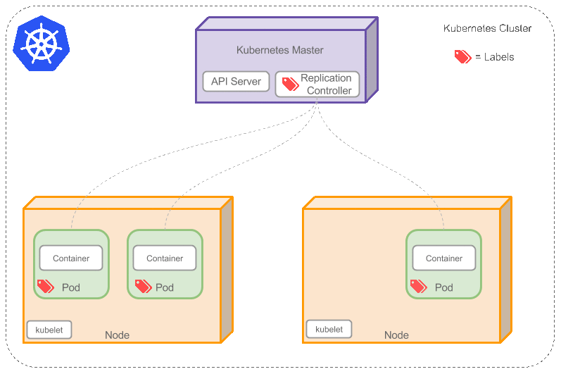
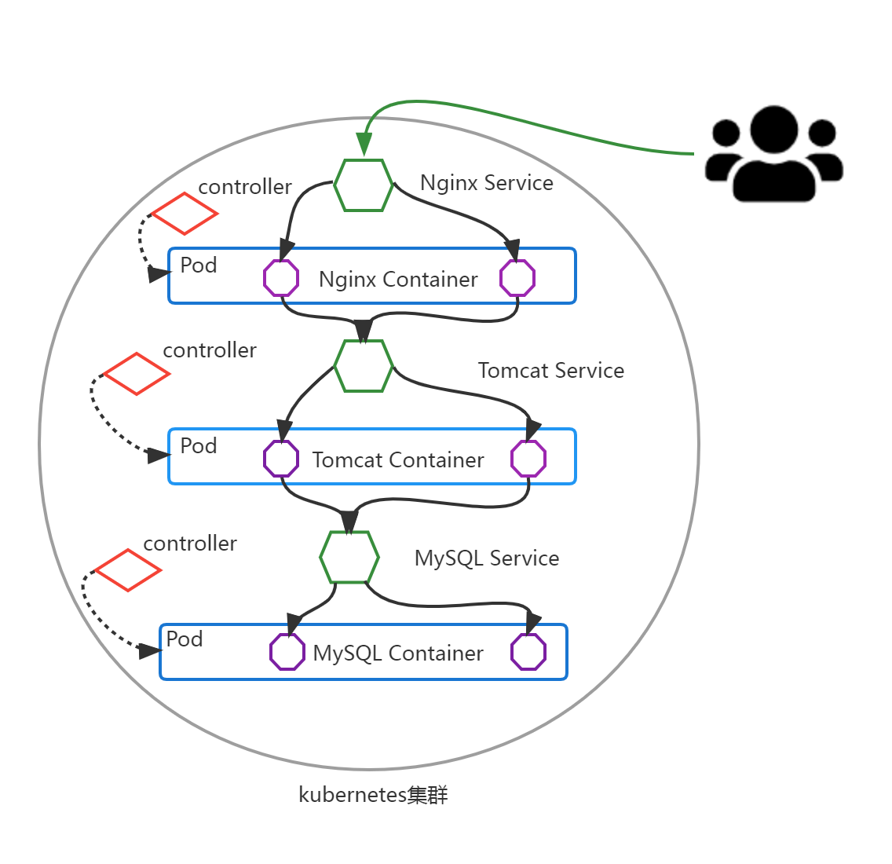

# Kubernetes核心概念

# 一、kubernetes核心概念

## 1.1 Pod

Pod是可以在 Kubernetes 中创建和管理的、最小的可部署的计算单元。

Pod就像豌豆荚一样，其中包含着一组（一个或多个）容器； 这些容器共享存储、网络、以及怎样运行这些容器的声明。

Pod就像一台物理服务器一样，其中包含一个或多个应用容器， 这些容器中运行着用户应用程序。

**举例说明Pod、Container、应用程序三者之间的关系：麻屋子,红帐子,里面住着白胖子。Pod就是麻屋子,Container就是红帐子,应用程序就是里面的白胖子。**

## 1.2 Controller

在 Kubernetes 中，用于管理和运行Pod的对象

在 Kubernetes 中，控制器通过监控集群的公共状态，并致力于将当前状态转变为期望的状态

**举例说明Controller(控制器)作用：房间里的温度自动调节器**

**当你设置了温度，告诉了温度自动调节器你的*期望状态（Desired State）*。 房间的实际温度是*当前状态（Current State）*。 通过对设备的开关控制，温度自动调节器让其当前状态接近期望状态。**

一个控制器至少追踪一种类型的 Kubernetes 资源。这些对象有一个代表期望状态的 `spec` 字段。 该资源的控制器负责确保其当前状态接近期望状态。

不同的类型的控制器所实现的控制方式不一样，例如：

- deployment 
  - 部署无状态应用
  - 部署无状态应用: 认为pod 都一样，没有顺序要求， 不用考虑在哪个node 运行，随意进行扩展和伸缩
  - 管理Pod和 ReplicaSet
  - 部署、滚动升级等
  - 典型的像web服务、分布式服务等
- StatefulSet 
  - 部署有状态应用
  - 有状态应用，每个pod 都独立运行，保持pod 启动顺序和唯一性； 有唯一的网络标识符，持久存储； 有序，比如mysql 主从； 主机名称固定。 而且其扩容以及升级等操作也是按顺序进行的操作。
- DaemonSet 
  - 部署守护进程
  - DaemonSet保证在每个Node上都运行一个容器副本，常用来部署一些集群的日志、监控或者其他系统管理应用。 新加入的node 也同样运行在一个pod 里面。
- job 
  - 一次性任务
  - Job负责批量处理短暂的一次性任务 (short lived one-off tasks)，即仅执行一次的任务，它保证批处理任务的一个或多个Pod成功结束。
- Cronjob 
  - 周期性定时任务

## 1.3 Label

### 1.3.1 Label介绍

Label是附着到object上（例如Pod）的键值对。可以在创建object的时候指定，也可以在object创建后随时指定。Labels的值对系统本身并没有什么含义，只是对用户才有意义。

一个Label是一个key=value的键值对，其中key与value由用户自己指定。

Label可以附加到各种资源对象上，例如Node、Pod、Service、RC等，一个资源对象可以定义任意数量的Label，同一个Label也可以被添加到任意数量的资源对象上去，Label通常在资源对象定义时确定，也可以在对象创建后动态添加或者删除。

我们可以通过指定的资源对象捆绑一个或多个不同的Label来实现多维度的资源分组管理功能，以便于灵活、方便地进行资源分配、调度、配置、部署等管理工作。例如：部署不同版本的应用到不同的环境中；或者监控和分析应用（日志记录、监控、告警）等。

一些常用abel示例如下所示:

版本标签："release" : "stable" , "release" : "canary"...

环境标签："environment" : "dev" , "environment" : "production"

架构标签："tier" : "frontend" , "tier" : "backend" , "tier" : "middleware"

分区标签："partition" : "customerA" , "partition" : "customerB"...

质量管控标签："track" : "daily" , "track" : "weekly"

Label相当于我们熟悉的“标签”，给某个资源对象定义一个Label，就相当于给它打了一个标签，随后可以通过Label Selector（标签选择器）查询和筛选拥有某些Label的资源对象，Kubernetes通过这种方式实现了类似SQL的简单又通用的对象查询机制。

### 1.3.2 Label语法及字符集

Label key的组成：

- 不得超过63个字符
- 可以使用前缀，使用/分隔，前缀必须是DNS子域，不得超过253个字符，系统中的自动化组件创建的label必须指定前缀，`kubernetes.io/`由kubernetes保留
- 起始必须是字母（大小写都可以）或数字，中间可以有连字符、下划线和点

Label value的组成：

- 不得超过63个字符
- 起始必须是字母（大小写都可以）或数字，中间可以有连字符、下划线和点

## 1.4 Label Selector

通过label selector，客户端／用户可以指定一个object集合，通过label selector对object的集合进行操作。

Label selector有两种类型：

- *equality-based（基于等式）* ：可以使用`=`、`==`、`!=`操作符，可以使用逗号分隔多个表达式
- *set-based*（基于集合） ：可以使用`in`、`notin`、`!`操作符，另外还可以没有操作符，直接写出某个label的key，表示过滤有某个key的object而不管该key的value是何值，`!`表示没有该label的object

**举例说明Label Selector**

**Label Selector可以被类比为SQL语句中的where查询条件，例如，name=redis-slave这个label Selector作用于Pod时，可以被类比为select * from pod where pod's name = 'redis-slave'这样的语句。**

## 1.5 Service

将运行在一组 Pods上的应用程序公开为网络服务的抽象方法。

由于Pod是非永久性资源对象，如果你使用Controller运行你的应用程序，你可以动态创建和销毁Pod，这样就会导致无法准确访问到所想要访问的Pod

例如：如果一组 Pod（称为“后端”）为集群内的其他 Pod（称为“前端”）提供功能， 那么前端如何找出并跟踪要连接的 IP 地址，以便前端可以使用提供工作负载的后端部分？

是一组iptables或ipvs规划，通过把客户端的请求转发到服务端（Pod）,如有多个Pod情况，亦可实现负载均衡的效果。

例如：一个图片处理后端，它运行了 3 个副本（Pod）。这些副本是可互换的 —— 前端不需要关心它们调用了哪个后端副本。 然而组成这一组后端程序的 Pod 实际上可能会发生变化， 前端客户端不应该也没必要知道，而且也不需要跟踪这一组后端的状态。

## 1.6 Endpoints

为Service管理后端Pod，当后端Pod被创建或销毁时，endpoints列表会更新Pod对应的IP地址，以便Service访问请求能够确保被响应。

## 1.7 DNS

为kubernetes集群内资源对象的访问提供名称解析，这样就可以实现通过DNS名称而非IP地址来访问服务。

- 实现集群内Service名称解析
- 实现集群内Pod内Container中应用访问互联网提供域名解析

# 二、Kubernetes核心概念之间的关系

## 2.1 Pod与Controller

pod 是通过Controller 实现应用的运维，比如伸缩，滚动升级等待。pod 和 controller 通过label 标签建立关系。

## 2.2 Pod与Service

service 是为了防止pod 失联，提供的服务发现，类似于微服务的注册中心。定义一组pod 的访问策略。可以为一组具有相同功能的容器应用提供一个统一的入口地址，并将请求负载分发到后端的各个容器应用上。

service 通过selector 来管控对应的pod。根据label 和 selector 建立关联，通过service 实现pod 的负载均衡。

## 2.3 Service与DNS

通过DNS实现对Service名称解析，以此达到访问后端Pod目的。

# 三、基于kubernetes集群容器化应用的微服务

## 3.1 服务部署方式介绍

- 单体服务架构
  - 所有服务进程运行在同一台主机内
- 分布式服务架构
  - 服务进程分布于不同的主机，其中一台主机出现故障，不影响其它主机上的服务运行
- 微服务架构
  - 使用容器化技术把分布式服务架构运行起来，并实现对不同的服务进程的高可用及快速发布等。

## 3.2 微服务架构服务组件（kubernetes核心概念）之间关系举例说明

以在kubernetes集群中运行LNMT应用为例：

把kubernetes集群看做是一个IDC机房，把LNMT Web架构应用以微服务（kubernetes集群资源对象）的方式部署到kubernetes集群中。

