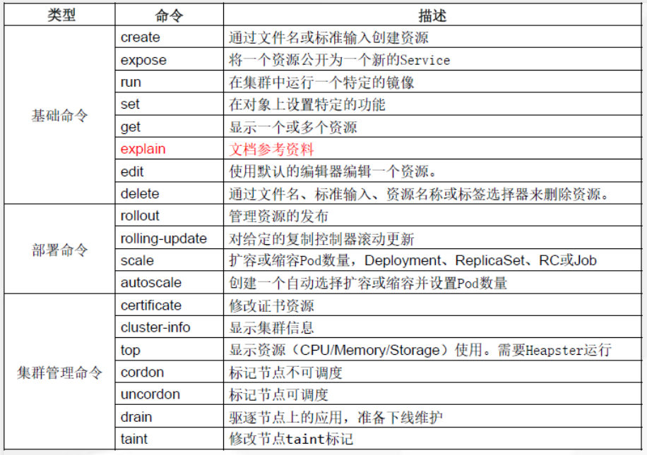

# 一、kubectl命令帮助

集群中的管理操作几乎都可以使用`kubectl`命令完成

```powershell
[root@k8s-master1 ~]# kubectl -h
```

# 二、kubectl命令说明




# 三、kubectl命令补全

~~~powershell
yum install -y bash-completion
source /usr/share/bash-completion/bash_completion
source <(kubectl completion bash)
kubectl completion bash > ~/.kube/completion.bash.inc
source '/root/.kube/completion.bash.inc'  
source $HOME/.bash_profile
~~~