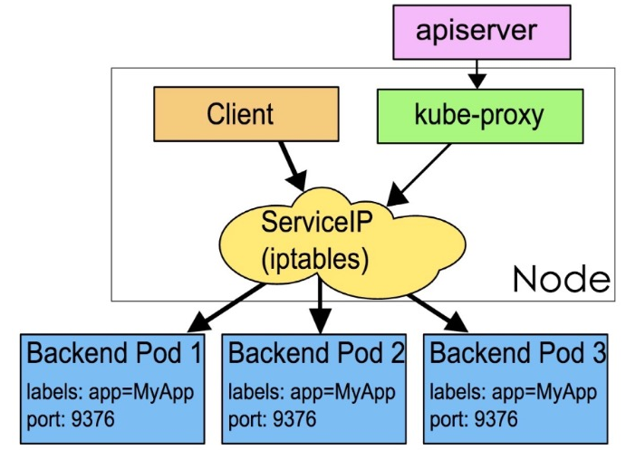

# kubernetes核心概念 Service

# 一、 service作用

使用kubernetes集群运行工作负载时，由于Pod经常处于用后即焚状态，Pod经常被重新生成，因此Pod对应的IP地址也会经常变化，导致无法直接访问Pod提供的服务，Kubernetes中使用了Service来解决这一问题，即在Pod前面使用Service对Pod进行代理，无论Pod怎样变化 ，只要有Label，就可以让Service能够联系上Pod，把PodIP地址添加到Service对应的端点列表（Endpoints）实现对Pod IP跟踪，进而实现通过Service访问Pod目的。

- 通过service为pod客户端提供访问pod方法，即可客户端访问pod入口
- 通过标签动态感知pod IP地址变化等
- 防止pod失联
- 定义访问pod访问策略
- 通过label-selector相关联
- 通过Service实现Pod的负载均衡（TCP/UDP 4层）
- 底层实现由kube-proxy通过userspace、iptables、ipvs三种代理模式

# 二、kube-proxy三种代理模式

- kubernetes集群中有三层网络，一类是真实存在的，例如Node Network、Pod Network,提供真实IP地址;一类是虚拟的，例如Cluster Network或Service Network，提供虚拟IP地址，不会出现在接口上，仅会出现在Service当中
- kube-proxy始终watch（监控）kube-apiserver上关于Service相关的资源变动状态，一旦获取相关信息kube-proxy都要把相关信息转化为当前节点之上的，能够实现Service资源调度到特定Pod之上的规则，进而实现访问Service就能够获取Pod所提供的服务

- kube-proxy三种代理模式：UserSpace模式、iptables模式、ipvs模式


## 2.1 UserSpace模式

userspace 模式是 kube-proxy 使用的第一代模式，该模式在 kubernetes v1.0 版本开始支持使用。

userspace 模式的实现原理图示如下：


kube-proxy 会为每个 Service 随机监听一个端口(proxy port)，并增加一条 iptables 规则。所以通过 ClusterIP:Port 访问 Service 的报文都 redirect 到 proxy port，kube-proxy 从它监听的 proxy port 收到报文以后，走 round robin(默认) 或是 session affinity(会话亲和力，即同一 client IP 都走同一链路给同一 pod 服务)，分发给对应的 pod。

由于 userspace 模式会造成所有报文都走一遍用户态（也就是 Service 请求会先从用户空间进入内核 iptables，然后再回到用户空间，由 kube-proxy 完成后端 Endpoints 的选择和代理工作），需要在内核空间和用户空间转换，流量从用户空间进出内核会带来性能损耗，所以这种模式效率低、性能不高，不推荐使用。


## 2.2 iptables模式

iptables 模式是 kube-proxy 使用的第二代模式，该模式在 kubernetes v1.1 版本开始支持，从 v1.2 版本开始成为 kube-proxy 的默认模式。

iptables 模式的负载均衡模式是通过底层 netfilter/iptables 规则来实现的，通过 Informer 机制 Watch 接口实时跟踪 Service 和 Endpoint 的变更事件，并触发对 iptables 规则的同步更新。

iptables 模式的实现原理图示如下：




通过图示我们可以发现在 iptables 模式下，kube-proxy 只是作为 controller，而不是 server，真正服务的是内核的 netfilter，体现在用户态的是 iptables。所以整体的效率会比 userspace 模式高。


## 2.3 ipvs模式

ipvs 模式被 kube-proxy 采纳为第三代模式，模式在 kubernetes v1.8 版本开始引入，在 v1.9 版本中处于 beta 阶段，在 v1.11 版本中正式开始使用。

ipvs(IP Virtual Server) 实现了传输层负载均衡，也就是 4 层交换，作为 Linux 内核的一部分。`ipvs`运行在主机上，在真实服务器前充当负载均衡器。ipvs 可以将基于 TCP 和 UDP 的服务请求转发到真实服务器上，并使真实服务器上的服务在单个 IP 地址上显示为虚拟服务。

ipvs 模式的实现原理图示如下：


ipvs 和 iptables 都是基于 netfilter 的，那么 ipvs 模式有哪些更好的性能呢？

- ipvs 为大型集群提供了更好的可拓展性和性能
- ipvs 支持比 iptables 更复杂的负载均衡算法（包括：最小负载、最少连接、加权等）
- ipvs 支持服务器健康检查和连接重试等功能
- 可以动态修改 ipset 的集合，即使 iptables 的规则正在使用这个集合

ipvs 依赖于 iptables。ipvs 会使用 iptables 进行包过滤、airpin-masquerade tricks(地址伪装)、SNAT 等功能，但是使用的是 iptables 的扩展 ipset，并不是直接调用 iptables 来生成规则链。通过 ipset 来存储需要 DROP 或 masquerade 的流量的源或目标地址，用于确保 iptables 规则的数量是恒定的，这样我们就不需要关心有多少 Service 或是 Pod 了。

使用 ipset 相较于 iptables 有什么优点呢？iptables 是线性的数据结构，而 ipset 引入了带索引的数据结构，当规则很多的时候，ipset 依然可以很高效的查找和匹配。我们可以将 ipset 简单理解为一个 IP(段) 的集合，这个集合的内容可以是 IP 地址、IP 网段、端口等，iptables 可以直接添加规则对这个“可变的集合进行操作”，这样就可以大大减少 iptables 规则的数量，从而减少性能损耗。

举一个例子，如果我们要禁止成千上万个 IP 访问我们的服务器，如果使用 iptables 就需要一条一条的添加规则，这样会在 iptables 中生成大量的规则；如果用 ipset 就只需要将相关的 IP 地址(网段)加入到 ipset 集合中，然后只需要设置少量的 iptables 规则就可以实现这个目标。

下面的表格是 ipvs 模式下维护的 ipset 表集合：

| 设置名称                       | 成员                                                         | 用法                                                         |
| :----------------------------- | :----------------------------------------------------------- | :----------------------------------------------------------- |
| KUBE-CLUSTER-IP                | 所有服务 IP + 端口                                           | 在 masquerade-all=true 或 clusterCIDR 指定的情况下对 Service Cluster IP 地址进行伪装，解决数据包欺骗问题 |
| KUBE-LOOP-BACK                 | 所有服务 IP + 端口 + IP                                      | 解决数据包欺骗问题                                           |
| KUBE-EXTERNAL-IP               | 服务外部 IP + 端口                                           | 将数据包伪装成 Service 的外部 IP 地址                        |
| KUBE-LOAD-BALANCER             | 负载均衡器入口 IP + 端口                                     | 将数据包伪装成 Load Balancer 类型的 Service                  |
| KUBE-LOAD-BALANCER-LOCAL       | 负载均衡器入口 IP + 端口 以及`externalTrafficPolicy=local`   | 接受数据包到 Load Balancer externalTrafficPolicy=local       |
| KUBE-LOAD-BALANCER-FW          | 负载均衡器入口 IP + 端口 以及`loadBalancerSourceRanges`      | 使用指定的 loadBalancerSourceRanges 丢弃 Load Balancer 类型 Service 的数据包 |
| KUBE-LOAD-BALANCER-SOURCE-CIDR | 负载均衡器入口 IP + 端口 + 源 CIDR                           | 接受 Load Balancer 类型 Service 的数据包，并指定 loadBalancerSourceRanges |
| KUBE-NODE-PORT-TCP             | NodePort 类型服务 TCP 端口                                   | 将数据包伪装成 NodePort（TCP）                               |
| KUBE-NODE-PORT-LOCAL-TCP       | NodePort 类型服务 TCP 端口，带有`externalTrafficPolicy=local` | 接受数据包到 NodePort 服务，使用 externalTrafficPolicy=local |
| KUBE-NODE-PORT-UDP             | NodePort 类型服务 UDP 端口                                   | 将数据包伪装成 NodePort(UDP)                                 |
| KUBE-NODE-PORT-LOCAL-UDP       | NodePort 类型服务 UDP 端口，使用`externalTrafficPolicy=local` | 接受数据包到 NodePort 服务，使用 externalTrafficPolicy=local |

## 2.4 iptables与ipvs对比

- iptables
  - 工作在内核空间
  - 优点
    - 灵活，功能强大（可以在数据包不同阶段对包进行操作）
  - 缺点
    - 表中规则过多时，响应变慢，即规则遍历匹配和更新，呈线性时延
- ipvs
  - 工作在内核空间
  - 优点
    - 转发效率高
    - 调度算法丰富：rr，wrr，lc，wlc，ip hash...
  - 缺点
    - 内核支持不全,低版本内核不能使用，需要升级到4.0或5.0以上。


- 使用iptables与ipvs时机
  - 1.10版本之前使用iptables(1.1版本之前使用UserSpace进行转发)
  - 1.11版本之后同时支持iptables与ipvs，默认使用ipvs，如果ipvs模块没有加载时，会自动降级至iptables

#  三、 service类型

Service类型决定了访问Service的方法

## 3.1 service类型

- ClusterIP

  - 默认，分配一个集群内部可以访问的虚拟IP

- NodePort

  - 在每个Node上分配一个端口作为外部访问入口
  - nodePort端口范围为:30000-32767

- LoadBalancer

  - 工作在特定的Cloud Provider上，例如Google Cloud，AWS，OpenStack

- ExternalName

  - 表示把集群外部的服务引入到集群内部中来，即实现了集群内部pod和集群外部的服务进行通信


## 3.2 Service参数

- port             访问service使用的端口

- targetPort  Pod中容器端口

- nodePort   通过Node实现外网用户访问k8s集群内service (30000-32767)

# 四、 Service创建

> Service的创建在工作中有两种方式，一是命令行创建，二是通过资源清单文件YAML文件创建。

## 4.1 ClusterIP类型

ClusterIP根据是否生成ClusterIP又可分为普通Service和Headless Service

Service两类：

- 普通Service: 

为Kubernetes的Service分配一个集群内部可访问的固定虚拟IP(Cluster IP), 实现集群内的访问。

- Headless Service: 

该服务不会分配Cluster IP, 也不通过kube-proxy做反向代理和负载均衡。而是通过DNS提供稳定的网络ID来访问，DNS会将headless service的后端直接解析为pod IP列表。


### 4.1.1 普通ClusterIP Service创建

#### 4.1.1.1 命令行创建Service

- 创建Deployment类型的应用

```powershell
[root@master01 ~]# cat 01_create_deployment_app_nginx.yaml
apiVersion: apps/v1
kind: Deployment
metadata:
  name: nginx-server1
spec:
  replicas: 2
  selector:
    matchLabels:
      app: nginx
  template:
     metadata:
       labels:
         app: nginx
     spec:
       containers:
       - name: c1
         image: nginx:1.15-alpine
         imagePullPolicy: IfNotPresent
         ports:
         - containerPort: 80
```


- 应用资源清单文件

~~~powershell
[root@master01 ~]# kubectl apply -f 01_create_deployment_app_nginx.yaml
~~~

- 验证Deployment类型的创建情况

```powershell
[root@master01 ~]# kubectl get deployment.apps
NAME            READY   UP-TO-DATE   AVAILABLE   AGE
nginx-server1   2/2     2            2           13s
```

- 创建ClusterIP类型service与Deployment类型应用关联

```powershell
命令创建service
[root@master01 ~]# kubectl expose deployment.apps nginx-server1 --type=ClusterIP --target-port=80 --port=80
```

~~~powershell
输出
service/nginx-server1 exposed
~~~

~~~powershell
说明
expose 创建service
deployment.apps 控制器类型
nginx-server1 应用名称，也是service名称
--type=ClusterIP 指定service类型
--target-port=80 指定Pod中容器端口
--port=80 指定service端口
~~~

#### 4.1.1.2 通过资源清单文件创建Service

~~~powershell
[root@master01 ~]# cat 02_create_deployment_app_nginx_with_service.yaml
apiVersion: apps/v1
kind: Deployment
metadata:
  name: nginx-server1
spec:
  replicas: 2
  selector:
    matchLabels:
      app: nginx
  template:
     metadata:
       labels:
         app: nginx
     spec:
       containers:
       - name: nginx-smart
         image: nginx:1.15-alpine
         imagePullPolicy: IfNotPresent
         ports:
         - containerPort: 80
---
apiVersion: v1
kind: Service
metadata:
  name: nginx-svc
spec:
  type: ClusterIP
  ports:
  - protocol: TCP
    port: 80
    targetPort: 80
  selector:
    app: nginx

~~~

~~~powershell
[root@master01 ~]# kubectl  apply -f 02_create_deployment_app_nginx_with_service.yaml
~~~

- 验证

```powershell
查看service
[root@master01 ~]# kubectl get service
NAME         TYPE        CLUSTER-IP       EXTERNAL-IP   PORT(S)    AGE
kubernetes   ClusterIP   10.96.0.1        <none>        443/TCP    4d15h
nginx-svc    ClusterIP   10.101.153.50   <none>        80/TCP    3s
```

```powershell
查看endpoints
[root@master01 ~]# kubectl get endpoints
NAME         ENDPOINTS                            AGE
kubernetes   192.168.122.30:6443                  4d15h
nginx-svc    172.16.189.74:80,172.16.235.150:80   8s
```

```powershell
查看Pod
[root@master01 ~]# kubectl get pods -l app=nginx
NAME                             READY   STATUS    RESTARTS   AGE
nginx-server1-77d4c485d8-gsrmq   1/1     Running   0          12s
nginx-server1-77d4c485d8-mmc52   1/1     Running   0          12s
```

#### 4.1.1.3 访问

```powershell
[root@master01 ~]# curl http://10.101.153.50:80
<!DOCTYPE html>
<html>
<head>
<title>Welcome to nginx!</title>
<style>
    body {
        width: 35em;
        margin: 0 auto;
        font-family: Tahoma, Verdana, Arial, sans-serif;
    }
</style>
</head>
<body>
<h1>Welcome to nginx!</h1>
<p>If you see this page, the nginx web server is successfully installed and
working. Further configuration is required.</p>

<p>For online documentation and support please refer to
<a href="http://nginx.org/">nginx.org</a>.<br/>
Commercial support is available at
<a href="http://nginx.com/">nginx.com</a>.</p>

<p><em>Thank you for using nginx.</em></p>
</body>
</html>
```

#### 4.1.1.4 两个pod里做成不同的主页方便测试负载均衡

```powershell
[root@master01 ~]# kubectl exec -it nginx-server1-77d4c485d8-gsrmq -- /bin/bash
root@deployment-nginx-6fcfb67547-nv7dn:/# cd /usr/share/nginx/html/
root@deployment-nginx-6fcfb67547-nv7dn:/usr/share/nginx/html# echo web1 > index.html
root@deployment-nginx-6fcfb67547-nv7dn:/usr/share/nginx/html# exit
exit
```

```powershell
[root@master01 ~]# kubectl exec -it nginx-server1-77d4c485d8-mmc52 -- /bin/bash
root@deployment-nginx-6fcfb67547-rqrcw:/# cd /usr/share/nginx/html/
root@deployment-nginx-6fcfb67547-rqrcw:/usr/share/nginx/html# echo web2 > index.html
root@deployment-nginx-6fcfb67547-rqrcw:/usr/share/nginx/html# exit
exit
```

####  4.1.1.5 测试

```powershell
[root@master01 ~]# curl 10.101.153.50
或
[root@master01 ~]# while true;do curl 10.101.153.50;sleep 1; done
```

### 4.1.2 Headless Service

- 普通的ClusterIP service是service name解析为cluster ip,然后cluster ip对应到后面的pod ip
- Headless service是指service name 直接解析为后面的pod ip

#### 4.1.2.1 编写用于创建Deployment控制器类型的资源清单文件

~~~powershell
[root@master01 ~]# cat 03_create_deployment_app_nginx.yaml
apiVersion: apps/v1
kind: Deployment
metadata:
  name: nginx-server1
spec:
  replicas: 2
  selector:
    matchLabels:
      app: nginx
  template:
     metadata:
       labels:
         app: nginx
     spec:
       containers:
       - name: nginx-smart
         image: nginx:1.15-alpine
         imagePullPolicy: IfNotPresent
         ports:
         - containerPort: 80
~~~

#### 4.1.2.2 通过资源清单文件创建headless Service

```powershell
编写YAML文件
命令
[root@master ~]# vim 04_headless-service.yml
apiVersion: v1
kind: Service
metadata:
  name: headless-service
  namespace: default
spec:
  type: ClusterIP     # ClusterIP类型,也是默认类型
  clusterIP: None     # None就代表是无头service
  ports:                                # 指定service 端口及容器端口
  - port: 80                            # service ip中的端口
    protocol: TCP
    targetPort: 80                      # pod中的端口
  selector:                             # 指定后端pod标签
     app: nginx                    # 可通过kubectl get pod -l app=nginx查看哪些pod在使用此标签
 
```

#### 4.1.2.3 应用资源清单文件创建headless Service

```powershell
命令
[root@master ~]# kubectl apply -f 04_headless_service.yml
输出
service/headless-service created
```

#### 4.1.2.4 查看已创建的headless Service

~~~powershell
命令
[root@master ~]# kubectl get svc
输出
NAME               TYPE        CLUSTER-IP       EXTERNAL-IP   PORT(S)          AGE
headless-service   ClusterIP   None             <none>        80/TCP           2m18s
kubernetes         ClusterIP   10.96.0.1        <none>        443/TCP          5d9h
可以看到headless-service没有CLUSTER-IP,用None表示
~~~

#### 4.1.2.5 DNS

DNS服务监视Kubernetes API,为每一个Service创建DNS记录用于域名解析

headless service需要DNS来解决访问问题

DNS记录格式为: <service-name>.<namespace-name>.svc.cluster.local.

##### 4.1.2.5.1 查看kube-dns服务的IP

```powershell
命令
[root@master1 ~]# kubectl get svc -n kube-system


输出
NAME             TYPE        CLUSTER-IP      EXTERNAL-IP   PORT(S)                  AGE
kube-dns         ClusterIP   10.96.0.2      <none>        53/UDP,53/TCP,9153/TCP   5d9h
metrics-server   ClusterIP   10.105.219.44   <none>        443/TCP                  45h
查看到coreDNS的服务地址是10.96.0.2
```

##### 4.1.2.5.2 在集群主机通过DNS服务地址查找无头服务的dns解析

```powershell
命令
[root@master01 ~]# dig -t A headless-service.default.svc.cluster.local. @10.96.0.2


输出
; <<>> DiG 9.11.4-P2-RedHat-9.11.4-16.P2.el7_8.2 <<>> -t A headless-service.default.svc.cluster.local. @10.96.0.2
;; global options: +cmd
;; Got answer:
;; WARNING: .local is reserved for Multicast DNS
;; You are currently testing what happens when an mDNS query is leaked to DNS
;; ->>HEADER<<- opcode: QUERY, status: NOERROR, id: 31371
;; flags: qr aa rd; QUERY: 1, ANSWER: 1, AUTHORITY: 0, ADDITIONAL: 1
;; WARNING: recursion requested but not available

;; OPT PSEUDOSECTION:
; EDNS: version: 0, flags:; udp: 4096
;; QUESTION SECTION:
;headless-service.default.svc.cluster.local. IN A #被解析域名

;; ANSWER SECTION:
headless-service.default.svc.cluster.local. 30 IN A 10.224.235.147 #注意这里IP

;; Query time: 0 msec
;; SERVER: 10.96.0.10#53(10.96.0.2)
;; WHEN: Sun May 17 10:58:50 CST 2020
;; MSG SIZE  rcvd: 129

```

##### 4.1.2.5.3  验证pod的IP

```powershell
命令
[root@master ~]# kubectl get pod -o wide
输出
NAME                                READY   STATUS             RESTARTS   AGE   IP               NODE      NOMINATED NODE   READINESS GATES
nginx-deployment-56bf6c9c8c-jmk7r   1/1     Running            0          35m   10.224.235.147   worker1   <none>           <none>


```

##### 4.1.2.5.4 在集群中创建一个pod验证

>创建一个镜像为busyboxplus:curl的pod，pod名称为bb2,用来解析域名

```powershell
命令
[root@master01 ~]# kubectl run bbp --image=busyboxplus:curl -it

或
[root@master01 ~]# kubectl run bbp --image=1.28 -it

输出
If you don't see a command prompt, try pressing enter.

解析域名
nslookup headless-service.default.svc.cluster.local.
访问命令
[ root@bbp:/ ]$ curl http://headless-service.default.svc.cluster.local.

输出
<!DOCTYPE html>
<html>
<head>
<title>Welcome to nginx!</title>
<style>
    body {
        width: 35em;
        margin: 0 auto;
        font-family: Tahoma, Verdana, Arial, sans-serif;
    }
</style>
</head>
<body>
<h1>Welcome to nginx!</h1>
<p>If you see this page, the nginx web server is successfully installed and
working. Further configuration is required.</p>

<p>For online documentation and support please refer to
<a href="http://nginx.org/">nginx.org</a>.<br/>
Commercial support is available at
<a href="http://nginx.com/">nginx.com</a>.</p>

<p><em>Thank you for using nginx.</em></p>
</body>
</html>
[ root@bbp:/ ]$ exit
Session ended, resume using 'kubectl attach bbp -c bbp -i -t' command when the pod is running
```

## 4.2 NodePort类型

- 创建资源清单文件

```powershell
[root@master01 ~]# cat 05_create_nodeport_service_app.yaml
apiVersion: apps/v1
kind: Deployment
metadata:
  name: nginx-app
  labels:
    app: nginx-app
spec:
  replicas: 2
  selector:
    matchLabels:
      app: nginx-app
  template:
    metadata:
      labels:
        app: nginx-app
    spec:
      containers:
      - name: c1
        image: nginx:1.15-alpine
        imagePullPolicy: IfNotPresent
        ports:
        - containerPort: 80
---
apiVersion: v1
kind: Service
metadata:
  name: nginx-app
spec:
  type: NodePort
  selector:
    app: nginx-app
  ports:
  - protocol: TCP
    nodePort: 30001
    port: 8060
    targetPort: 80
```

- 应用资源清单文件

```powershell
[root@master01 ~]# kubectl apply -f 05_create_nodeport_service_app.yaml
deployment.apps/nginx-app created
service/nginx-app created
```

- 验证service创建

```powershell
[root@master01 ~]# kubectl get deployment.apps
NAME         READY   UP-TO-DATE   AVAILABLE   AGE
nginx-app    2/2     2            2           26s


[root@master01 ~]# kubectl get svc
NAME         TYPE        CLUSTER-IP       EXTERNAL-IP   PORT(S)          AGE
kubernetes   ClusterIP   10.96.0.1        <none>        443/TCP          2d22h
nginx-app    NodePort    10.104.157.20    <none>        8060:30001/TCP   36s

[root@master01 ~]# kubectl get endpoints
NAME         ENDPOINTS                       AGE
kubernetes   192.168.122.10:6443             2d22h
nginx-app    172.16.1.24:80,172.16.2.20:80   2m10s


[root@master01 ~]# ss -anput | grep ":30001"
tcp    LISTEN     0      128      :::30001                :::*                   users:(("kube-proxy",pid=5826,fd=9))

[root@worker01 ~]# ss -anput | grep ":30001"
tcp    LISTEN     0      128      :::30001                :::*                   users:(("kube-proxy",pid=4937,fd=11))

[root@worker02 ~]# ss -anput | grep ":30001"
tcp    LISTEN     0      128      :::30001                :::*                   users:(("kube-proxy",pid=5253,fd=11))

```

```powershell
[root@master01 ~]# kubectl get pods
NAME                          READY   STATUS    RESTARTS   AGE
nginx-app-ffd5ccc78-cnwbx    1/1     Running   0          8m59s
nginx-app-ffd5ccc78-mz77g    1/1     Running   0          8m59s

[root@master01 ~]# kubectl exec -it nginx-app-ffd5ccc78-cnwbx -- bash
root@nginx-app-ffd5ccc78-cnwbx:/# echo "nginx-app-1" > /usr/share/nginx/html/index.html
root@nginx-app-ffd5ccc78-cnwbx:/# exit
exit
[root@master01 ~]# kubectl exec -it nginx-app-ffd5ccc78-mz77g -- bash
root@nginx-app-ffd5ccc78-mz77g:/# echo "nginx-app-2" > /usr/share/nginx/html/index.html
root@nginx-app-ffd5ccc78-mz77g:/# exit
exit
```

- 在与kubernetes 节点同一网络主机中访问k8s集群内service

```powershell
[root@bogon ~]# curl http://192.168.10.12:30001
nginx-app-2
[root@bogon ~]# curl http://192.168.10.13:30001
nginx-app-1
[root@bogon ~]# curl http://192.168.10.14:30001
nginx-app-1
[root@bogon ~]# curl http://192.168.10.15:30001
nginx-app-2
```

## 4.3 LoadBalancer

### 4.3.1 集群外访问过程

- #### 用户

- #### 域名

- #### 云服务提供商提供LB服务

- #### NodeIP:Port(service IP)

- #### Pod IP：端口


### 4.3.2  自建Kubernetes的LoadBalancer类型服务方案-MetalLB

MetalLB可以为kubernetes集群中的Service提供网络负载均衡功能。

MetalLB两大功能为:

- 地址分配，类似于DHCP
- 外部通告，一旦MetalLB为服务分配了外部IP地址，它就需要使群集之外的网络意识到该IP在群集中“存在”。MetalLB使用标准路由协议来实现此目的：ARP，NDP或BGP。

#### 4.3.2.1  参考资料

参考网址： https://metallb.universe.tf/installation/

#### 4.3.2.2  应用资源清单文件

~~~powershell
资源清单文件下载：
# kubectl apply -f https://raw.githubusercontent.com/metallb/metallb/v0.12.1/manifests/namespace.yaml
# kubectl apply -f https://raw.githubusercontent.com/metallb/metallb/v0.12.1/manifests/metallb.yaml
~~~

#### 4.3.2.3 准备metallb配置文件

~~~powershell
[root@nginx metallb]# cat metallb-conf.yaml
apiVersion: v1
kind: ConfigMap
metadata:
  namespace: metallb-system
  name: config
data:
  config: |
    address-pools:
    - name: default
      protocol: layer2
      addresses:
      - 192.168.10.90-192.168.10.100
 
192.168.10.90-192.168.10.100是集群节点服务器IP同一段。

~~~

~~~powershell
在master01节点应用资源清单文件
[root@master01 ~]# kubectl apply -f metallb-conf.yaml	
~~~

~~~powershell
验证配置
# kubectl describe configmap config -n metallb-system
Name:         config
Namespace:    metallb-system
Labels:       <none>
Annotations:  <none>

Data
====
config:
----
address-pools:
- name: default
  protocol: layer2
  addresses:
  - 192.168.10.90-192.168.10.100

Events:  <none>
~~~

#### 4.3.2.4发布Service类型为LoadBalancer的Deployment控制器类型应用

```powershell
创建Deployment控制器类型应用nginx-metallb及service，service类型为LoadBalancer

[root@master01 ~]# vim 02_nginx-metabllb.yaml
apiVersion: apps/v1
kind: Deployment
metadata:
  name: nginx-metallb
spec:
  selector:
    matchLabels:
      app: nginx
  template:
    metadata:
      labels:
        app: nginx
    spec:
      containers:
      - name: nginx-metallb1
        image: nginx:1.15-alpine
        imagePullPolicy: IfNotPresent
        ports:
        - containerPort: 80

---
apiVersion: v1
kind: Service
metadata:
  name: nginx-metallb
spec:
  ports:
  - port: 8090
    protocol: TCP
    targetPort: 80
  selector:
    app: nginx
  type: LoadBalancer
  
[root@master01 ~]# kubectl apply -f nginx.yaml
```

#### 4.3.2.5 验证

```powershell
[root@master01 ~]# kubectl get ns
NAME                   STATUS   AGE
default                Active   16d
kube-node-lease        Active   16d
kube-public            Active   16d
kube-system            Active   16d
kubernetes-dashboard   Active   13d
metallb-system         Active   130m
test1                  Active   12d
[root@master01 ~]# kubectl get pods -n metallb-system
NAME                         READY   STATUS    RESTARTS   AGE
controller-64f8f944d-qdf8m   1/1     Running   0          110m
speaker-cwzq7                1/1     Running   0          110m
speaker-qk5fb                1/1     Running   0          110m
speaker-wsllb                1/1     Running   0          110m
speaker-x4bwt                1/1     Running   0          110m

[root@master01 ~]# kubectl get svc
NAME            TYPE           CLUSTER-IP      EXTERNAL-IP      PORT(S)          AGE
kubernetes      ClusterIP      10.96.0.1       <none>           443/TCP          16d
nginx-metallb   LoadBalancer   10.105.239.69   192.168.10.90   8090:31372/TCP   106m

[root@master01 ~]# ping 192.168.10.90
PING 192.168.10.90 (192.168.10.90) 56(84) bytes of data.
64 bytes from 192.168.10.90: icmp_seq=1 ttl=64 time=3.45 ms
64 bytes from 192.168.10.90: icmp_seq=2 ttl=64 time=0.040 ms
```

#### 4.3.2.6 访问

```powershell
[root@master01 ~]# curl http://192.168.122.90:8090
<!DOCTYPE html>
<html>
<head>
<title>Welcome to nginx!</title>
<style>
    body {
        width: 35em;
        margin: 0 auto;
        font-family: Tahoma, Verdana, Arial, sans-serif;
    }
</style>
</head>
<body>
<h1>Welcome to nginx!</h1>
<p>If you see this page, the nginx web server is successfully installed and
working. Further configuration is required.</p>

<p>For online documentation and support please refer to
<a href="http://nginx.org/">nginx.org</a>.<br/>
Commercial support is available at
<a href="http://nginx.com/">nginx.com</a>.</p>

<p><em>Thank you for using nginx.</em></p>
</body>
</html>
```


**注意：使用kubeadm部署kubernetes集群修改方法**


~~~powershell
如果在IPVS模式下使用kube-proxy，从Kubernetes v1.14.2开始，必须启用ARP模式。

可以通过在当前集群中编辑kube-proxy配置来实现：
# kubectl edit configmap -n kube-system kube-proxy

并设置：
apiVersion: kubeproxy.config.k8s.io/v1alpha1
kind: KubeProxyConfiguration
mode: "ipvs"
ipvs:
  strictARP: true
~~~

## 4.4 ExternalName

### 4.4.1 ExternalName作用

- 把集群外部的服务引入到集群内部中来，实现了集群内部pod和集群外部的服务进行通信
- ExternalName 类型的服务适用于外部服务使用域名的方式，缺点是不能指定端口
- 还有一点要注意: 集群内的Pod会继承Node上的DNS解析规则。所以只要Node可以访问的服务，Pod中也可以访问到, 这就实现了集群内服务访问集群外服务

### 4.4.2   将公网域名引入

1, 编写YAML文件

```powershell
 [root@master01 ~]# vim externelname.yml
 
apiVersion: v1
kind: Service
metadata:
  name: my-externalname
  namespace: default
spec:
  type: ExternalName
  externalName: www.baidu.com                  # 对应的外部域名为www.baidu.com
 
```

2, 应用YAML文件

```powershell
 [root@master01 ~]# kubectl apply -f externelname.yml
 service/my-externalname created
```

3, 查看service

```powershell
 [root@master01 ~]# kubectl get svc |grep exter
 my-externalname    ExternalName   <none>         www.baidu.com   <none>         69s
```

4, 查看my-service的dns解析

```powershell
 [root@master01 ~]# dig -t A my-externalname.default.svc.cluster.local. @10.96.0.2
 
 ; <<>> DiG 9.9.4-RedHat-9.9.4-72.el7 <<>> -t A my-externalname.default.svc.cluster.local. @10.2.0.2
 ;; global options: +cmd
 ;; Got answer:
 ;; ->>HEADER<<- opcode: QUERY, status: NOERROR, id: 31378
 ;; flags: qr aa rd; QUERY: 1, ANSWER: 4, AUTHORITY: 0, ADDITIONAL: 1
 ;; WARNING: recursion requested but not available
 
 ;; OPT PSEUDOSECTION:
 ; EDNS: version: 0, flags:; udp: 4096
 ;; QUESTION SECTION:
 ;my-externalname.default.svc.cluster.local. IN A
 
 ;; ANSWER SECTION:
 my-externalname.default.svc.cluster.local. 5 IN CNAME www.baidu.com.
 www.baidu.com.          5       IN      CNAME   www.a.shifen.com.
 www.a.shifen.com.       5       IN      A       14.215.177.38           解析的是百度的IP
 www.a.shifen.com.       5       IN      A       14.215.177.39           解析的是百度的IP
 
 ;; Query time: 32 msec
 ;; SERVER: 10.2.0.2#53(10.96.0.2)
 ;; WHEN: Thu Nov 05 11:23:41 CST 2020
 ;; MSG SIZE  rcvd: 245
```

```powershell
 [root@master01 ~]# kubectl exec -it deploy-nginx-6c9764bb69-86gwj -- /bin/sh
 / # nslookup www.baidu.com
 ......
 Name:      www.baidu.com
 Address 1: 14.215.177.39
 Address 2: 14.215.177.38
 
 
 / # nslookup my-externalname.default.svc.cluster.local         
 ......
 Name:      my-externalname.default.svc.cluster.local
 Address 1: 14.215.177.38
 Address 2: 14.215.177.39
```

解析此`my-externalname.default.svc.cluster.local`域名和解析`www.baidu.com`是一样的结果

### 4.4.3 不同命名空间访问

1， 创建ns1命名空间和相关deploy, pod,service

```powershell
 [root@master01 ~]# vim ns1-nginx.yml
apiVersion: v1                                                  
kind: Namespace                                                 
metadata:                                                             
  name: ns1                                                     # 创建ns1命名空间
---
apiVersion: apps/v1
kind: Deployment
metadata:
  name: deploy-nginx                    
  namespace: ns1                                                # 属于ns1命名空间
spec:
  replicas: 1                                  
  selector:
    matchLabels:
      app: nginx                                
  template:                                        
    metadata:
      labels:
        app: nginx                             
    spec:
      containers:                              
      - name: nginx
        image: nginx:1.15-alpine
        imagePullPolicy: IfNotPresent
        ports:
        - containerPort: 80
---
apiVersion: v1
kind: Service
metadata:
  name: svc1                                # 服务名
  namespace: ns1                            # 属于ns1命名空间
spec:
  selector:
    app: nginx
  clusterIP: None                           # 无头service
  ports:
  - port: 80                         
    targetPort: 80                  
---
kind: Service
apiVersion: v1
metadata:
  name: external-svc1
  namespace: ns1                            #  属于ns1命名空间
spec:
  type: ExternalName
  externalName: svc2.ns2.svc.cluster.local   # 将ns2空间的svc2服务引入到ns1命名空间
   
   
 [root@master1 ~]# kubectl apply -f ns1-nginx.yml
 namespace/ns1 created
 deployment.apps/deploy-nginx created
 service/svc1 created
 
```

2， 创建ns2命名空间和相关deploy, pod,service

```powershell
[root@master01 ~]# vim ns1-nginx.yml
apiVersion: v1                                                  
kind: Namespace                                                 
metadata:                                                             
  name: ns2                                                     # 创建ns2命名空间
---
apiVersion: apps/v1
kind: Deployment
metadata:
  name: deploy-nginx                    
  namespace: ns2                                                # 属于ns2命名空间
spec:
  replicas: 1                                  
  selector:
    matchLabels:
      app: nginx                                
  template:                                        
    metadata:
      labels:
        app: nginx                             
    spec:
      containers:                              
      - name: nginx
        image: nginx:1.15-alpine
        imagePullPolicy: IfNotPresent
        ports:
        - containerPort: 80
---
apiVersion: v1
kind: Service
metadata:
  name: svc2                                # 服务名
  namespace: ns2                            # 属于ns2命名空间
spec:
  selector:
    app: nginx
  clusterIP: None                           # 无头service
  ports:
  - port: 80                         
    targetPort: 80                  
---
kind: Service
apiVersion: v1
metadata:
  name: external-svc1
  namespace: ns2                            #  属于ns2命名空间
spec:
  type: ExternalName
  externalName: svc1.ns1.svc.cluster.local   # 将ns1空间的svc1服务引入到ns2命名空间
```

```powershell
 [root@master01 ~]# kubectl apply -f ns2-nginx.yml
 namespace/ns2 created
 deployment.apps/deploy-nginx created
 service/svc2 created
 service/external-svc2 created
```

3,  在ns1命名空间的pod里验证

```powershell
 [root@master01 ~]# kubectl get pods -n ns1
 NAME                            READY   STATUS    RESTARTS   AGE
 deploy-nginx-6c9764bb69-g5xl8   1/1     Running   0          8m10s
```

```powershell
 [root@master01 ~]# kubectl exec -it -n ns1 deploy-nginx-6c9764bb69-g5xl8 -- /bin/sh
 / # nslookup svc1
 ......
 Name:      svc1
 Address 1: 10.3.166.140 deploy-nginx-6c9764bb69-g5xl8       IP与ns1里的podIP一致(见下面的查询结果)
 
 / # nslookup svc2.ns2.svc.cluster.local
 .....
 Name:      svc2.ns2.svc.cluster.local
 Address 1: 10.3.104.17 10-3-104-17.svc2.ns2.svc.cluster.local   IP与ns2里的podIP一致(见下面的查询结果)
 
 / # exit
 
```

```powershell
 [root@master01 ~]# kubectl get pods -o wide -n ns1
 NAME                            READY   STATUS    RESTARTS   AGE   IP             NODE             NOMINATED NODE   READINESS GATES
 deploy-nginx-6c9764bb69-g5xl8   1/1     Running   0          70m   10.3.166.140   192.168.122.13   <none>           <none>
 [root@master01 ~]# kubectl get pods -o wide -n ns2
 NAME                            READY   STATUS    RESTARTS   AGE   IP            NODE             NOMINATED NODE   READI            NESS GATES
 deploy-nginx-6c9764bb69-8psxl   1/1     Running   0          68m   10.3.104.17   192.168.122.14   <none>           <none>
 
```

反之，在ns2命名空间的pod里访问`svc1.ns1.svc.cluster.local`，解析的IP是ns1命名空间里的pod的IP(请自行验证)

4， 验证ns2中的pod的IP变化, ns1中的pod仍然可以使用`svc2.ns2.svc.cluster.local`访问

```powershell
 [root@master01 ~]# kubectl get pod -n ns2
 NAME                            READY   STATUS    RESTARTS   AGE
 deploy-nginx-6c9764bb69-8psxl   1/1     Running   0          81m
 
 [root@master01 ~]# kubectl delete pod deploy-nginx-6c9764bb69-8psxl -n ns2
 pod "deploy-nginx-6c9764bb69-8psxl" deleted                   因为有replicas控制器，所以删除pod会自动拉一个起来
 
 [root@master01 ~]# kubectl get pod -o wide -n ns2
 NAME                            READY   STATUS    RESTARTS   AGE     IP             NODE             NOMINATED NODE   READINESS GATES
 deploy-nginx-6c9764bb69-8qbz2   1/1     Running   0          5m36s   10.3.166.141   192.168.122.13   <none>           <none>
 
 pod名称变了,IP也变成了10.3.166.141
```

回到ns1中的pod验证

```powershell
 [root@master01 ~]# kubectl exec -it -n ns1 deploy-nginx-6c9764bb69-g5xl8 -- /bin/sh
 
 / # ping svc2.ns2.svc.cluster.local -c 2
 PING svc2.ns2.svc.cluster.local (10.3.166.141): 56 data bytes    解析的IP就是ns2中pod的新IP
 64 bytes from 10.3.166.141: seq=0 ttl=63 time=0.181 ms
 64 bytes from 10.3.166.141: seq=1 ttl=63 time=0.186 ms
 
 --- svc2.ns2.svc.cluster.local ping statistics ---
 2 packets transmitted, 2 packets received, 0% packet loss
 round-trip min/avg/max = 0.181/0.183/0.186 ms
 / # exit
 
```

# 五、sessionAffinity

> 会话粘贴

设置sessionAffinity为Clientip  (类似nginx的ip_hash算法,lvs的sh算法)

~~~powershell
[root@nginx ~]# cat 02_create_deployment_app_nginx_with_service.yaml
apiVersion: apps/v1
kind: Deployment
metadata:
  name: nginx-server1
spec:
  replicas: 2
  selector:
    matchLabels:
      app: nginx
  template:
     metadata:
       labels:
         app: nginx
     spec:
       containers:
       - name: c1
         image: nginx:1.15-alpine
         imagePullPolicy: IfNotPresent
         ports:
         - containerPort: 80
---
apiVersion: v1
kind: Service
metadata:
  name: nginx-svc
spec:
  type: ClusterIP
  ports:
  - protocol: TCP
    port: 80
    targetPort: 80
  selector:
    app: nginx
~~~

~~~powershell
[root@master01 ~]# kubectl apply -f 02_create_deployment_app_nginx_with_service.yaml
deployment.apps/nginx-server1 created
service/nginx-svc created
~~~

~~~powershell
[root@master01 ~]# kubectl get pods
NAME                             READY   STATUS    RESTARTS   AGE
nginx-server1-58845f75f4-9zlnw   1/1     Running   0          2m11s
nginx-server1-58845f75f4-ffqdt   1/1     Running   0          2m11s
[root@master01 ~]# kubectl exec -it nginx-server1-58845f75f4-9zlnw bash
kubectl exec [POD] [COMMAND] is DEPRECATED and will be removed in a future version. Use kubectl kubectl exec [POD] -- [COMMAND] instead.
root@nginx-server1-58845f75f4-9zlnw:/# echo web1 > /usr/share/nginx/html/index.html
root@nginx-server1-58845f75f4-9zlnw:/# exit
exit
[root@master01 ~]# kubectl exec -it nginx-server1-58845f75f4-ffqdt bash
kubectl exec [POD] [COMMAND] is DEPRECATED and will be removed in a future version. Use kubectl kubectl exec [POD] -- [COMMAND] instead.
root@nginx-server1-58845f75f4-ffqdt:/# echo web2 > /usr/share/nginx/html/index.html
root@nginx-server1-58845f75f4-ffqdt:/# exit
exit
~~~

~~~powershell
[root@master01 ~]# kubectl get svc
NAME         TYPE        CLUSTER-IP     EXTERNAL-IP   PORT(S)   AGE
kubernetes   ClusterIP   10.96.0.1      <none>        443/TCP   16d
nginx-svc    ClusterIP   10.100.53.31   <none>        80/TCP    3m53s
[root@master01 ~]# curl http://10.100.53.31
web1
[root@master01 ~]# curl http://10.100.53.31
web2
或
[root@master01 ~]# while true;do curl 10.100.53.31;sleep 1; done
~~~

```powershell
[root@master01 ~]# kubectl patch svc nginx-svc -p '{"spec":{"sessionAffinity":"ClientIP"}}'
service/nginx-svc patched

[root@master01 ~]# curl 10.100.53.31
web1
多次访问,会话粘贴
```

```powershell
设置回sessionAffinity为None
[root@master01 ~]# kubectl patch svc nginx-svc -p '{"spec":{"sessionAffinity":"None"}}'
service/my-service patched

```

~~~powershell
测试
[root@master01 ~]# curl 10.100.53.31
web1
多次访问,回到负载均衡
或
[root@master01 ~]# while true;do curl 10.100.53.31;sleep 1; done
web1
多次访问,会话粘贴

~~~

# 六、修改为ipvs调度方式（拓展）

> 部署方式不同，修改方法不一样。
>
> 本次主要介绍使用kubeadm部署集群方式，二进制部署较为简单。
>
> 二进制部署修改：/etc/kubernetes/kube-proxy.yaml文件即可。

从kubernetes1.8版本开始，新增了kube-proxy对ipvs的支持，在kubernetes1.11版本中被纳入了GA.

## 6.1 修改为IPVS调度方式前升级内核

> 现使用Centos7u6发布版本，默认内核版本为3.10.0，使用kubernetes为1.18.0时，可升级内核版本至4.18.0或5.6.0版本。

>在所有节点中安装,需要重启操作系统更换内核。以下升级方法供参考。

~~~powershell
[root@localhost ~]# yum -y install perl

[root@localhost ~]# rpm --import https://www.elrepo.org/RPM-GPG-KEY-elrepo.org

[root@localhost ~]# yum -y install https://www.elrepo.org/elrepo-release-7.0-4.el7.elrepo.noarch.rpm

[root@localhost ~]# yum  --enablerepo="elrepo-kernel"  -y install kernel-ml.x86_64 
此处升级为5.0以上版本。

[root@localhost ~]# grub2-set-default 0

[root@localhost ~]# grub2-mkconfig -o /boot/grub2/grub.cfg

[root@localhost ~]# reboot
~~~

## 6.2 修改kube-proxy的配置文件

```powershell
[root@master01 ~]# kubectl edit configmap kube-proxy -n kube-system
     26     iptables:
     27       masqueradeAll: false
     28       masqueradeBit: 14
     29       minSyncPeriod: 0s
     30       syncPeriod: 30s
     31     ipvs:
     32       excludeCIDRs: null
     33       minSyncPeriod: 0s
     34       scheduler: ""	  # 可以在这里修改ipvs的算法,默认为rr轮循算法
     35       strictARP: false
     36       syncPeriod: 30s
     37     kind: KubeProxyConfiguration
     38     metricsBindAddress: 127.0.0.1:10249
     39     mode: "ipvs"	  # 默认""号里为空,加上ipvs
```

## 6.3  查看kube-system的namespace中kube-proxy有关的pod

```powershell
[root@master01 ~]# kubectl get pods -n kube-system |grep kube-proxy
kube-proxy-69mv6                           1/1     Running   6          2d18h
kube-proxy-jpc6c                           1/1     Running   4          4d16h
kube-proxy-kq65l                           1/1     Running   4          4d16h
kube-proxy-lmphf                           1/1     Running   5          4d16h
```

## 6.4 验证kube-proxy-xxx的pod中的信息

```powershell
[root@master01 ~]# kubectl logs kube-proxy-jpc6c -n kube-system
W0517 00:55:10.914754       1 server_others.go:559] Unknown proxy mode "", assuming iptables proxy
I0517 00:55:10.923228       1 node.go:136] Successfully retrieved node IP: 192.168.122.32
I0517 00:55:10.923264       1 server_others.go:186] Using iptables Proxier.
I0517 00:55:10.923567       1 server.go:583] Version: v1.18.2
I0517 00:55:10.923965       1 conntrack.go:100] Set sysctl 'net/netfilter/nf_conntrack_max' to 131072
I0517 00:55:10.924001       1 conntrack.go:52] Setting nf_conntrack_max to 131072
I0517 00:55:10.924258       1 conntrack.go:83] Setting conntrack hashsize to 32768
I0517 00:55:10.927041       1 conntrack.go:100] Set sysctl 'net/netfilter/nf_conntrack_tcp_timeout_established' to 86400
I0517 00:55:10.927086       1 conntrack.go:100] Set sysctl 'net/netfilter/nf_conntrack_tcp_timeout_close_wait' to 3600
I0517 00:55:10.927540       1 config.go:315] Starting service config controller
I0517 00:55:10.927556       1 shared_informer.go:223] Waiting for caches to sync for service config
I0517 00:55:10.927576       1 config.go:133] Starting endpoints config controller
I0517 00:55:10.927594       1 shared_informer.go:223] Waiting for caches to sync for endpoints config
I0517 00:55:11.027749       1 shared_informer.go:230] Caches are synced for service config
I0517 00:55:11.027858       1 shared_informer.go:230] Caches are synced for endpoints config
```

## 6.5 重新启动kube-proxy

> 删除kube-proxy-xxx的所有pod，让它重新拉取新的kube-proxy-xxx的pod

~~~powershell
[root@master01 ~]# kubectl delete pod kube-proxy-69mv6 -n kube-system
pod "kube-proxy-69mv6" deleted

[root@master01 ~]# kubectl delete pod kube-proxy-jpc6c -n kube-system
pod "kube-proxy-jpc6c" deleted

[root@master01 ~]# kubectl delete pod kube-proxy-kq65l -n kube-system
pod "kube-proxy-kq65l" deleted

[root@master01 ~]# kubectl delete pod kube-proxy-lmphf -n kube-system
pod "kube-proxy-lmphf" deleted

~~~

~~~powershell
[root@master01 ~]# kubectl get pods -n kube-system |grep kube-proxy
kube-proxy-2mk2b                           1/1     Running   0          2m23s
kube-proxy-5bj87                           1/1     Running   0          30s
kube-proxy-7qq9l                           1/1     Running   0          52s
kube-proxy-tjtqf                           1/1     Running   0          80s

~~~

~~~powershell
随意查看其中1个或3个kube-proxy-xxx的pod,验证是否为IPVS方式了

[root@master1 ~]# kubectl logs kube-proxy-tjtqf -n kube-system
I0517 02:32:26.557696       1 node.go:136] Successfully retrieved node IP: 192.168.122.32
I0517 02:32:26.557745       1 server_others.go:259] Using ipvs Proxier.
W0517 02:32:26.557912       1 proxier.go:429] IPVS scheduler not specified, use rr by default
I0517 02:32:26.560008       1 server.go:583] Version: v1.18.2
I0517 02:32:26.560428       1 conntrack.go:52] Setting nf_conntrack_max to 131072
I0517 02:32:26.561094       1 config.go:315] Starting service config controller
I0517 02:32:26.562251       1 shared_informer.go:223] Waiting for caches to sync for service config
I0517 02:32:26.561579       1 config.go:133] Starting endpoints config controller
I0517 02:32:26.562271       1 shared_informer.go:223] Waiting for caches to sync for endpoints config
I0517 02:32:26.662541       1 shared_informer.go:230] Caches are synced for service config
I0517 02:32:26.662566       1 shared_informer.go:230] Caches are synced for endpoints config
~~~
